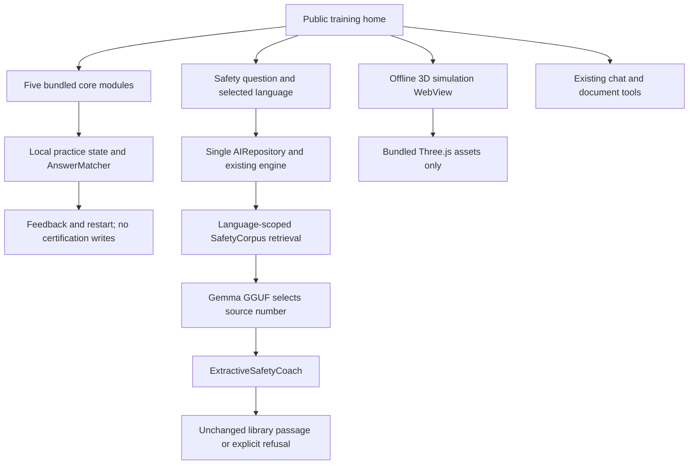

# Jaagruk Native Web Parity

## Authoritative Projects

- Android implementation: `Jaagruk - Kotlin/Jaagruk-Mobile`, module `:app`.
- Product and frontend reference: `sih-safety-sim`.
- Parent Kotlin app: reference implementation only. Its build/test results do not validate this app.

## Implemented In This Pass

- Direct public training home, not a splash or sign-in gate.
- Five modules from the existing `:core` catalog. Each practice supports single answers, multiple answers,
  ordered sequences, feedback, completion and restart. Spatial decisions are presented as text choices;
  this is not AR and never writes a score, assessment run or certificate.
- Offline 3D simulation entrypoints for the five training modules, rendered from a bundled Three.js scene
  package under `app/src/main/assets/simulation/`. The WebView is network-blocked and loads only the local
  scene assets. This is an interactive 3D training view, not camera tracking or assessed AR.
- English, Hindi and Santali shell/catalog resources are present for the training and safety coach flows.
  Santali is authored Ol Chiki text and still requires native mine-site vocabulary review before field use.
- Persisted in-app language selection; translated navigation labels.
- Separate safety coach backed by `AIRepository.askSafety`, retrieval and an extractive selector.
  The model now chooses one retrieved source document by number; the displayed answer is the unchanged
  library passage, not free-form generated safety advice. Stop, background and screen exit cancel the request.
- Original chat, document/OCR tools, Circle Learn and library remain reachable. Their generic output is
  not a checked safety answer and does not share the new coach's acceptance claim.

## Pipeline



## Remaining Work

- Camera AR, marker setup, assessed AR, worker identity, QR verification and certificate screens are not yet
  connected here. Data-layer classes alone do not make these workflows complete.
- Santali text still needs native-speaker validation before industrial use. Glyph rendering tests cannot
  establish linguistic correctness.
- Real-model source selection still needs safety-expert review; passing automated guards is not a safety approval.
- Speech, camera, two-device drills, offline sync and backend configuration need independent device tests.
- Generic chat and tools retain inherited UI and behavior; this is not a completed whole-app redesign.

## Reproducible Gates

```powershell
.\gradlew.bat :core:test :ai:testDebugUnitTest :app:assembleLeanDebug :app:assembleLeanDebugAndroidTest --max-workers=2
```

Device test classes:
- `org.jaagruk.safety.ui.TrainingLanguageTest`: real language menu, persistence across activity recreation,
  catalog rendering and screenshots in English, Hindi and Santali; restores the original preference.
- `org.jaagruk.safety.ui.TrainingNavigationTest`: public startup and safety-coach navigation.
- `org.jaagruk.safety.ui.TrainingPracticeTest`: every decision and restart, five modules x three locales.
- `org.jaagruk.safety.DeviceModelAcceptanceTest`: real local JNI generation with raw output, timings,
  refusal checks, language limits and drill interlock. Requires a licensed installed GGUF.
- `org.jaagruk.safety.SafetyDisplayDeviceTest`: the real repository must not expose an unverified harness paraphrase.
- `org.jaagruk.safety.ExtractiveModelDeviceTest`: real local model source selection, exact displayed passage
  equality, off-topic refusal and Santali unsupported behavior. Requires a licensed installed GGUF.
- `org.jaagruk.safety.ui.SimulationDeviceTest`: native WebView scene readiness, nonblank screenshot sampling,
  action/pause/reset command bridge and transition into practice.

The model test writes `files/device-model-acceptance.json` in the target app. A rejected useful question
is a failure, not silently counted as a pass. Keep hardware, model checksum and APK provenance with results.

## Device Validation: 2026-09-30

Target: `Jaagruk-Mobile`, package `org.jaagruk.safety`, lean debug APK. Tested on the connected
Samsung SM-S721B, Android 16 / API 36, arm64. These results do not cover other phones or Android 10.

- Build: app and instrumentation APKs assembled successfully after the 3D/UI/localisation pass.
- JVM tests: 608 core and 72 AI, zero failures or errors. `:app:testLeanDebugUnitTest` has no local tests.
- Device UI: 17 tests passed in 54.439 seconds. Includes all five practices in all three locales,
  restart, public startup, coach routing and persisted language selection.
- Local 3D renderer check: all five scene bundles report `sceneReady=true`, one canvas, no JavaScript error,
  and nonblank mobile screenshots. Sampled unique-colour counts: fire 481, gas 466, machinery 453,
  height 469, electrical 430. Evidence is in `docs/validation/2026-09-30/local-3d/`.
- Translation audit: PASS, English 344 keys, Hindi 344, Santali 344. `tools/check-strings.ps1` also
  verifies format argument indices and types.
- The Hindi retrieval regression covers both methane spellings and requires gas guidance first.
- Real-model extractive rerun: five nominal questions selected the expected unchanged passages, including
  Hindi methane, with zero failures. Off-topic, prompt-injection and Santali unsupported cases were also
  checked by `ExtractiveModelDeviceTest`; the result file is `files/extractive-model-evaluation.json` on
  the target app and was copied into the console log during validation.
- Native 3D WebView test status: the first run failed before the WebView asset-loader fix because the scene
  never reached `sceneReady` on device. The app was rebuilt to load the HTML from local assets with a trusted
  base URL, block network loads, and log WebView console messages. Rerun is pending because the connected
  Samsung is currently on the secure lock screen, which prevents Compose instrumentation from launching the
  app activity. The latest APK and test APK are installed and ready to rerun after unlock.

APK SHA-256: `6ef323678c9510a70d0466ce0858b130b64971f6bfddcd948a2d752f87a65378`.

Model: Gemma 3 1B IT Q4_K_M, 806058240 bytes, installed separately into the app's private storage.
Model SHA-256: `8ccc5cd1f1b3602548715ae25a66ed73fd5dc68a210412eea643eb20eb75a135`.
The lean APK does not ship the model; its presence on this phone must not be assumed on a new install.

Evidence is in `docs/validation/2026-09-30/`: UI test output, home screenshots and raw model reports.
No AR or camera-tracking acceptance is claimed by these practice tests. Santali generated answers
remain explicitly unsupported. Native-speaker review and safety-expert review are still required.

## Material UI and WebView Follow-up: 2026-09-30

The blank native scene was traced to a zero-height HTML root inside the WebView.
Percentage and viewport CSS heights resolved to zero despite a nonzero Android
view height. The WebView now declares match-parent layout parameters, and the
page synchronizes its root height with innerHeight on load and resize.

The Android wrapper no longer forces the CSS fallback. Readiness is reported by
the Three.js frame loop, not a timer checking for a canvas element.

Pixel 9 Pro emulator: all five SimulationDeviceTest cases passed in 168.639 s.
These check rendered pixel diversity, action changes, orbit input, pause, reset,
and navigation to practice. Evidence: validation/2026-09-30/material-3d-tests.txt
and material-3d-*.png. This supersedes the pending emulator rendering status;
the Samsung physical-device rerun is still outstanding.

Settings now use flat sections, wrapping label/value rows, the current locale
name, and a single semantic theme toggle. Simulation actions wrap, its controls
scroll within a bounded area, and system-bar icons follow the app theme.

APK SHA-256 used for the five renderer tests:
`d7f1adec4a350582080f7aa1c689e740e1c643f1b8c21704ca7aea2aba13f5b0`.

These are illustrative offline 3D scenes, not camera-tracked AR.

Final UI-only follow-up (status-bar timing and dark status colors) was rebuilt,
installed, and visually checked at 130% font scale in dark mode. Final APK SHA-256:
`ecbed4ffcdf266e75c7a7eb05c2146cc3a5c5d512b4e66cb5e1d172795755b98`.
The scene bundle was unchanged by that follow-up. Navigation and locale tests
also passed at 130% text size (2 tests, 36.632 s). Font scale was restored to 1.0.
The emulator has no installed AI model; this run did not validate inference.

## Final Physical-phone Verification: 2026-09-30

Installed the final APK above on Samsung SM-S721B (Android 16) using an in-place
update, preserving application data and the previously installed local model.

- ExtractiveModelDeviceTest: PASS, 1 test in 50.170 s. All five nominal English
  and Hindi questions selected the expected exact corpus passages (5.3-11.6 s
  per answer). Off-topic and injection refusal, and explicit Santali unsupported
  behavior, also passed.
- UI suite: PASS, 22 tests in 70.575 s. Five real WebView/Three.js scene tests,
  public navigation, persisted language selection, and 15 full practice/restart
  cases spanning five modules and three locales.
- The blank native scene is resolved on this physical phone as well as the
  emulator. Camera-tracked AR is not covered or implemented by these scene tests.
- Evidence: validation/2026-09-30/phone-final-ai.txt, phone-final-ai.json,
  phone-final-ui.txt, phone-final-*.png.

Santali training rendering passes; Santali generated AI answers remain unsupported.
These tests establish app behavior, not expert approval of safety content.
