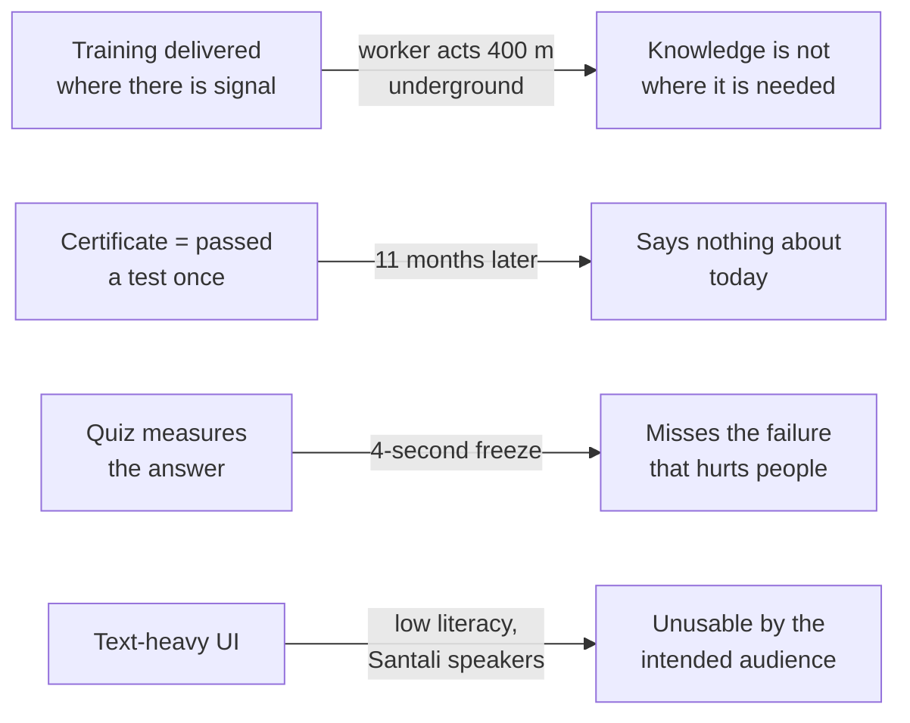
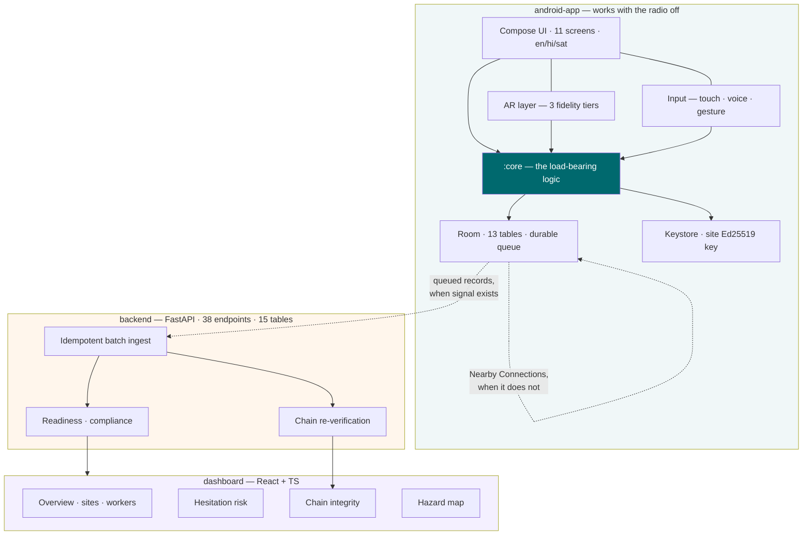
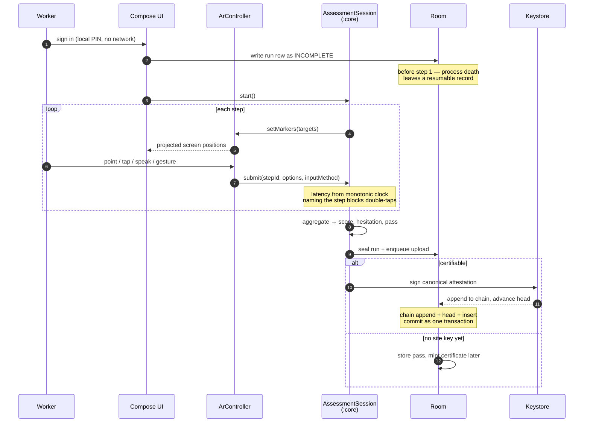
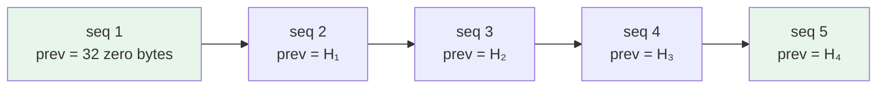
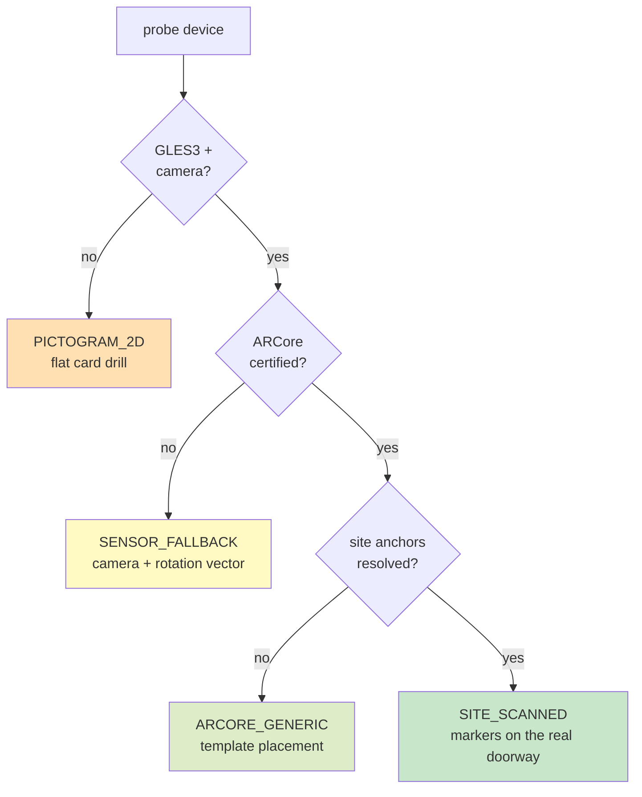

<div align="center">

# जागरुक · Jaagruk · ᱡᱟᱜᱨᱩᱠ

**AR-based vocational safety training and certification for Jharkhand's mining, steel and mica operations.**

Offline-first. Android 10+. No headset. Certificates that verify with no network at all.

`SIH problem statement 26041`

**437** core tests · **53** Android tests · **217** backend tests · **56/56** live smoke checks · **0** lint errors · **27 MB** APK

</div>

---

> *Jaagruk* means **alert**, **watchful**. Not "trained once".

---

## Contents

| | |
|---|---|
| [1. The problem, precisely](#1-the-problem-precisely) | [8. Voice, and why it had to be built from scratch](#8-voice-and-why-it-had-to-be-built-from-scratch) |
| [2. What Jaagruk is, in 60 seconds](#2-what-jaagruk-is-in-60-seconds) | [9. Comparison: how else this gets done](#9-comparison-how-else-this-gets-done) |
| [3. How it works](#3-how-it-works) | [10. Efficiency and footprint](#10-efficiency-and-footprint) |
| [4. The certificate](#4-the-certificate) | [11. Quality gates](#11-quality-gates) |
| [5. Measuring the decision, not the answer](#5-measuring-the-decision-not-the-answer) | [12. Getting it running](#12-getting-it-running) |
| [6. Readiness decay: the finding nobody else surfaces](#6-readiness-decay-the-finding-nobody-else-surfaces) | [13. Repository layout](#13-repository-layout) |
| [7. The AR fidelity ladder](#7-the-ar-fidelity-ladder) | [14. Decisions worth defending](#14-decisions-worth-defending) |
| | [15. Honest limitations](#15-honest-limitations) |

---

## 1. The problem, precisely

Safety training in this sector does not fail because workers are untrained. Most have sat through an
induction. It fails in four specific, addressable ways.



| # | The failure | What it actually looks like | What Jaagruk does about it |
|---|---|---|---|
| 1 | **Delivery / need mismatch** | Learned in a canteen with Wi-Fi, needed in a haulage road with none | Everything load-bearing runs with the radio off — drills, scoring, signing, verification |
| 2 | **Certificates are binary and stale** | "Valid until March" tells you nothing about competence in February | Readiness decays on a curve and is recomputed on read; statutory validity is reported *separately* |
| 3 | **Knowing ≠ acting** | Worker knows to raise the alarm, hesitates four seconds | Every step timed against an expert baseline; correct-but-slow is its own outcome class |
| 4 | **Literacy and language** | A large share cannot comfortably read; many speak Santali, which no speech engine supports | Zero-text pictogram mode, three languages at 569 keys each, per-site voice enrolment |

Everything below follows from those four. The AR is a delivery mechanism, not the point.

---

## 2. What Jaagruk is, in 60 seconds

<table>
<tr><td width="50%" valign="top">

**Trains in AR on the phone the worker already owns.**
5 modules, 11 scenarios. Fire evacuation and confined-space gas entry ship as complete AR experiences with
markers pinned to the site's real exits and vents.

**Measures decisions, not answers.**
Monotonic-clock timing against expert baselines. Hesitation surfaces as its own dashboard cohort.

**Certificates verify with nothing.**
The QR *is* the certificate — 158 signed bytes, not a lookup key. Linked into a per-site tamper-evident hash
chain.

</td><td width="50%" valign="top">

**Works offline, then delivers.**
Durable queue, idempotent upload, or peer-to-peer relay out of a shaft on a supervisor's handset. A
contractor arriving mid-shift is enrolled on the handset itself, with no uplink, and reconciles later.

**Tracks readiness, not just certification.**
Decay computed on read. No job that could have failed silently.

**Speaks the worker's language — or none.**
English, Hindi, Santali (Ol Chiki). 73 ISO 7010 pictograms for zero-text mode.

**Runs a real two-phone buddy drill.**
Bluetooth + Wi-Fi Direct, no internet. An NPC partner would train none of the skill.

</td></tr>
</table>

---

## 3. How it works

### 3.1 The shape of the system



The dashed arrows are the only network dependencies in the diagram, and neither is on the training path.

### 3.2 Why `:core` is a plain JVM module

Every rule that decides whether a worker is certified — scoring, hesitation classification, Ed25519 signing,
chain linkage, QR encoding, readiness decay, keyword spotting, buddy-drill sequencing — lives in `core/`,
which has **no Android dependency at all**.

| | Logic in the app module | Logic in `:core` (chosen) |
|---|---|---|
| Test runtime | Emulator or device, minutes | Plain JVM, **1.6 s for 437 tests** |
| Determinism | Real clocks, real sensors | Injected `MonotonicTimeSource` / `WallClock` |
| Can you test a 6-week decay? | Only by waiting | `FixedWallClock`, instantly |
| Can you test a 2-phone drill? | Two devices | Two machines + one fake clock |
| Cross-language byte parity | Impossible to assert | Same fixtures asserted from Kotlin **and** Python |

A scoring engine you can only test on a device is a scoring engine nobody tests.

### 3.3 One drill, end to end



Two details in that diagram are the difference between a demo and something usable:

- **The run row is written before step 1.** A process kill mid-drill leaves a resumable record with the
  latencies already measured, instead of nothing.
- **`submit()` must name the step it is answering.** A glove double-tap or a voice command recognised 80 ms
  late becomes an explicit `STALE_STEP` rather than accidentally answering the *next* step in zero
  milliseconds — which is exactly how a scoring engine certifies somebody who never saw the question.

---

## 4. The certificate

### 4.1 Anatomy

The QR carries the certificate itself. There is no server lookup, no database row to trust, no network.

```
┌─────────────────────────────────────────────────────────────────┐
│  JGK1:  <base64url payload>                    216 characters   │
└─────────────────────────────────────────────────────────────────┘
             │
             ▼  158 bytes, canonical big-endian, length-prefixed
┌───────────────────────────┬──────────┬──────────────────────────┐
│ field                     │  bytes   │ why                      │
├───────────────────────────┼──────────┼──────────────────────────┤
│ formatVersion             │     1    │ refuse a future format   │
│ siteId          (len+utf8)│  2 + ≤16 │ capped by the QR budget  │
│ seq                       │     4    │ position in the chain    │
│ workerIdHash              │    32    │ SHA-256 — never the id   │
│ moduleCode                │     1    │ frozen 1..5              │
│ scorePermille             │     2    │ 0..1000                  │
│ medianLatencyMs           │     4    │ the decision measurement │
│ outcomeFlags              │     1    │ passed/hesitation/buddy/ │
│                           │          │ site-scanned/refresher/  │
│                           │          │ assisted                 │
│ issuedAtEpochMin          │     4    │ minutes, not seconds     │
│ prevRecordHash            │    32    │ chain linkage            │
│ signature (Ed25519)       │    64    │ over all of the above    │
└───────────────────────────┴──────────┴──────────────────────────┘
```

**128 of 158 bytes — 81 % — is cryptographic material** (two 32-byte hashes + a 64-byte signature). The
format overhead is the remaining 30 bytes. There is almost nothing to trim, which is the point of designing
the encoding before choosing the container.

### 4.2 Why not JWT, or X.509, or a URL

| Approach | Would it fit a scannable QR? | Verifies offline? | Leaks worker identity? | Verdict |
|---|---|---|---|---|
| **Jaagruk canonical + Ed25519** | **158 B → 216 chars** ✅ | ✅ | ✅ hash only | chosen |
| Signed JWT (`EdDSA`) | Hex hashes double, JSON keys repeat, then base64 on top — roughly **2× larger** *(estimate)* | ✅ | ✅ | rejected: no benefit, worse density |
| X.509 certificate | ASN.1 + DER + subject/issuer chain — far larger | ✅ | depends on subject | rejected: enormous for 10 fields |
| RSA-2048 signature | 256-byte signature alone exceeds our whole payload | ✅ | ✅ | rejected: won't fit |
| URL → server lookup | Tiny QR ✅ | ❌ **needs network** | ❌ id in the URL | rejected: fails at the mine gate |

The URL row is the one that matters. A verification scheme that needs connectivity does not work at the
place verification happens.

> A `https://…/v/<payload>` form **is** supported — but only as a convenience so a stock camera app can hand
> off to Jaagruk. The signed bytes travel inside it, and verification is still entirely local. The URL is
> never part of the trust path.

### 4.3 The chain



`record_hash = SHA-256(canonical_bytes ‖ signature)`

Hashing the **payload plus the signature** — not the payload alone — is deliberate. If the chain committed
only to payload bytes, a record could be re-signed under a different key and spliced into another chain
undetected.

Seven verdicts, not two:

| Verdict | Means | Inspector action |
|---|---|---|
| `VERIFIED` | Signature valid, links correctly into the chain this device holds | Accept |
| `SIGNATURE_VALID_CHAIN_UNKNOWN` | Signature genuine; this device holds no chain copy | Accept — sync later to cross-check |
| `SEQUENCE_GAP` | Valid and linked, but records in between are missing here | Accept with note |
| `BROKEN_LINK` | Does not link to its predecessor | **Refuse** — indicates interference |
| `BAD_SIGNATURE` | Altered, or signed by the wrong key | **Refuse** |
| `UNKNOWN_SITE_KEY` | No public key for that site on this device | Sync once, re-check |
| `MALFORMED` | Not a Jaagruk certificate | Not our code |

Collapsing these into valid/invalid would either cry wolf on every fresh handset (`CHAIN_UNKNOWN`) or hide
real tampering (`BROKEN_LINK`). Either way inspectors stop trusting the tool.

**It is a hash chain. It is not a blockchain, and nothing in this repository says it is.** No consensus, no
distributed ledger, no proof of anything. A per-site append-only chain with signed links — which is exactly
what the problem needs, and overselling it would be the first thing an assessor took apart.

---

## 5. Measuring the decision, not the answer

### 5.1 The scoring model

```
step score = 0.70 × accuracy  +  0.30 × latency term
```

| Constant | Value | Reasoning |
|---|---|---|
| `ACCURACY_WEIGHT` | `0.70` | Being right dominates. Speed is a modifier, not the goal. |
| `LATENCY_WEIGHT` | `0.30` | Enough to separate a confident worker from a hesitant one |
| `SLOW_FACTOR` | `2.0` | Beyond 2× the expert baseline the answer is `CORRECT_SLOW` |
| `SUSPICIOUS_FAST_MS` | `250` | Below human reaction time — this is tapping, not deciding |
| `SUSPICIOUS_FAST_VOID_THRESHOLD` | `3` | Three such answers voids the run as `GUESS_PATTERN` |
| `DEFAULT_PASS_THRESHOLD_PERMILLE` | `700` | 70 % |
| `DEFAULT_HESITATION_RATIO_LIMIT` | `0.34` | Hesitating on a third of steps fails, even if all are correct |
| `BACKGROUND_ABORT_MS` | `5 min` | Longer away is a different session, not an interruption |

### 5.2 Five outcomes, not two

| Outcome | Right? | Answered? | Counted in score? | Why it is separate |
|---|---|---|---|---|
| `CORRECT_FAST` | ✅ | ✅ | ✅ | Genuinely ready |
| `CORRECT_SLOW` | ✅ | ✅ | ✅ | **Knows it, may freeze when it counts** |
| `INCORRECT` | ❌ | ✅ | ✅ | Wrong |
| `TIMEOUT` | ❌ | ❌ | ✅ | No answer — recorded distinctly from wrong |
| `SKIPPED` | — | ❌ | ❌ excluded | Never reached; must not dilute the denominator |

`CORRECT_SLOW` is the whole reason this project exists. A quiz records it as correct. Jaagruk records it, flags
the certificate, and puts the worker on a dashboard cohort a site officer can act on.

### 5.3 What the clock does and does not count

```mermaid
gantt
    dateFormat  X
    axisFormat  %Ss
    title Step latency — paused time is folded out
    section Counted
    thinking          :0, 3
    more thinking     :7, 9
    section NOT counted
    tracking lost     :3, 5
    supervisor calls  :5, 7
```



Being interrupted is not hesitation. Tracking loss, backgrounding, a lost peer, or stepping outside the
cleared zone all stop the clock — and the pause overlay says *"paused time is not counted against you"*,
because a worker who thinks it is running will rush back and answer badly.

All timing comes from a **monotonic** clock. Wall time only dates the run. On a shared site phone whose clock
is corrected mid-shift, a wall-clock delta can go **negative** — and a negative decision latency would corrupt
the one measurement the whole platform rests on.

---

## 6. Readiness decay: the finding nobody else surfaces

### 6.1 The model

```
readiness(t) = baseScore × 0.5 ^ (elapsed_days / half_life)
```

| Constant | Value |
|---|---|
| `INITIAL_HALF_LIFE_DAYS` | `45.0` |
| `HALF_LIFE_GROWTH_PER_STAGE` | `0.5` (each refresher extends it by 50 %) |
| `MAX_HALF_LIFE_DAYS` | `180.0` — never claim a skill is permanent |
| Bands | `READY ≥ 700` · `DUE ≥ 500` · `STALE ≥ 300` · else `EXPIRED` |

Computed **on read**, never stored. There is no nightly decay job that could have failed silently; a handset
that spent six weeks underground reports correctly the instant it powers on.

### 6.2 The chart that makes the argument

A worker who passes at **850 ‰** and does no refreshers *(derived from the formula above)*:

```
readiness ‰   one █ = 20 ‰   base score 850 ‰   refresher stage 0
                          300       500       700        band thresholds
                           ▼         ▼         ▼

day   0  850 ██████████████████████████████████████████  READY
day   7  763 ██████████████████████████████████████      READY
day  13  696 ██████████████████████████████████          DUE      first day under 700
day  30  535 ██████████████████████████                  DUE
day  35  496 ████████████████████████                    STALE    first day under 500
day  45  425 █████████████████████                       STALE
day  68  298 ██████████████                              EXPIRED  first day under 300
day  90  213 ██████████                                  EXPIRED
day 180   53 ██                                          EXPIRED
day 365    3                                             EXPIRED  certificate still valid
```

| Day | Readiness | Band | Statutory certificate |
|---:|---:|---|---|
| 0 | **850** | READY | valid |
| 7 | 763 | READY | valid |
| **13** | 696 | **DUE** — first day below 700 | valid |
| 30 | 535 | DUE | valid |
| **35** | 496 | **STALE** — first day below 500 | valid |
| 45 | 425 | STALE | valid |
| **68** | 298 | **EXPIRED** — first day below 300 | valid |
| 90 | 213 | EXPIRED | valid |
| 180 | 53 | EXPIRED | valid |
| **365** | **3** | EXPIRED | **still valid** |

**That last row is the entire argument.** At day 364 this worker is legally cleared to enter a confined space
and would, by this model, retain almost nothing. A pass/fail record shows a tick. Jaagruk shows both numbers
and never merges them, because the cohort that is *statutorily valid and operationally stale* is precisely the
one a blended score hides.

The dashboard surfaces it as its own count: **`statutorilyValidButStale`**.

### 6.3 What refreshers actually buy

Half-life grows with each completed refresher stage. Readiness at **day 90** *(derived)*:

| Refresher stage | Half-life | Readiness at day 90 | Band |
|---:|---:|---:|---|
| 0 (never refreshed) | 45 d | 213 | EXPIRED |
| 1 | 67.5 d | 337 | STALE |
| 2 | 90 d | 425 | STALE |
| 3 | 112.5 d | 488 | STALE |
| 4 | 135 d | 535 | DUE |
| 6+ (capped) | 180 d | 601 | DUE |

A two-minute refresher every few weeks is worth more than an annual re-certification — which is the
spaced-repetition literature's actual claim, applied.

> **A refresher renews readiness. It never renews the statutory clock.** Only a full module re-run does.
> Otherwise a two-minute check would silently extend a twelve-month legal certificate, and the button in the
> app says so.

---

## 7. The AR fidelity ladder

Roughly a third of mid-range Android stock in this market is not ARCore certified — disproportionately the
handsets a contract worker actually owns. Requiring ARCore would make the app invisible on Play to exactly the
audience the problem statement is about.



| Tier | Camera | Turning looks around | Walking moves the scene | Anchored to real objects | Assessment |
|---|:-:|:-:|:-:|:-:|---|
| `SITE_SCANNED` | ✅ | ✅ | ✅ | ✅ | **identical** |
| `ARCORE_GENERIC` | ✅ | ✅ | ✅ | ❌ | **identical** |
| `SENSOR_FALLBACK` | ✅ | ✅ | ❌ | ❌ | **identical** |
| `PICTOGRAM_2D` | ❌ | — | — | ❌ | **identical** |

Same steps, same timeouts, same expert baselines, same hesitation detection, same scoring, same certificate.
**Only the presentation differs — and which tier was used is signed into the certificate**, so a run that fell
back to sensors can never claim it happened in a site-scanned scene.

### Why markers are Compose, not OpenGL

ARCore will only hand its camera image to a GL texture, so there is exactly one GLES3 shader in this
codebase: a full-screen quad for the camera background. Markers are ordinary composables, positioned by
projecting the anchor into screen space with the same view/projection matrices GL would have used.

| | GL-rendered markers | Compose markers (chosen) |
|---|---|---|
| Screen reader | ❌ a quad has no semantics | ✅ real content descriptions |
| Devanagari / Ol Chiki | ❌ hand-rolled text pipeline | ✅ platform shaping |
| Touch targets | manual hit-boxes | ✅ standard, 64 dp enforced |
| Frame budget | spent on glyph atlases | ✅ spent on nothing |

`ContentDescription` is a **fatal** lint check. GL quads could not have satisfied it.

---

## 8. Voice, and why it had to be built from scratch

Santali has roughly **seven million speakers**, concentrated in exactly the districts this app targets, and
**no speech engine supports it** — not Vosk, not Whisper, not Google's on-device ASR. Waiting for a corpus is
not a plan.

So the vocabulary is fixed at **19 words**, a supervisor records them once per site, and matching is MFCC +
DTW entirely on device. No model download, no network, no cloud.

### The measured separation profile

These are **not** guesses. `DtwSeparationTest` prints them on every run — the figures below are from the last
one:

```
                       DTW cost      0        0.5       1.0       1.5       2.0       2.5       3.0
                                     ├─────────┼─────────┼─────────┼─────────┼─────────┼─────────┤
identical recording      0.0000      zero cost - identical input, no bar
same word + mic noise    0.5877      ███████████
same word,  8% slower    0.6262      ████████████
same word, 46% slower    0.6779      █████████████           ┊ worst legitimate cost
                                                             ┊
        accept threshold   1.20                   ═══════════┊  1.77× headroom above the worst legitimate cost
                                                             ┊
different command        2.3810      ███████████████████████████████████████████████
white noise              2.7157      ██████████████████████████████████████████████████████
```

| Threshold | Value | Distance to nearest failure mode |
|---|---|---|
| `acceptCost` | `1.20` | **1.77×** above the worst legitimate same-word cost (0.678) |
| | | **1.98×** below the nearest different command (2.381) |
| `minMargin` | `0.15` | Best two candidates must differ by this, or the app asks the worker to repeat |
| `NOISY_ENVIRONMENT` | `1.60 / 0.25` | Relaxed profile for a running conveyor |

**The first thresholds were wrong.** Initial guesses of `acceptCost = 0.55`, `minMargin = 0.06` rejected
legitimate re-recordings of the same word — the worst same-word case is 0.678, comfortably *above* 0.55. The
test exists so nobody has to take the replacements on trust.

Enrolment quality is checked before anything is stored: two takes, compared to each other. A template built
from a cough or a clipped word is worse than no template, because it produces *confident wrong answers*
during a live drill.

Below 6 enrolled commands, voice input is **hidden rather than offered broken**. A worker who tries voice
three times and is ignored stops using the working input too.

---

## 9. Comparison: how else this gets done

### 9.1 Against the alternatives

| | Classroom / toolbox talk | Video e-learning | VR headset training | Generic quiz app | **Jaagruk** |
|---|:-:|:-:|:-:|:-:|:-:|
| Works with no network | ✅ | ❌ | ⚠️ tethered setup | ❌ | ✅ |
| Runs on the worker's own phone | — | ✅ | ❌ | ✅ | ✅ |
| Hardware cost per worker | ₹0 | ₹0 | high | ₹0 | **₹0** |
| Spatial — "point at *your* exit" | ⚠️ if walked | ❌ | ✅ | ❌ | ✅ |
| Measures decision latency | ❌ | ❌ | ⚠️ rarely | ❌ | ✅ |
| Detects hesitation separately | ❌ | ❌ | ❌ | ❌ | ✅ |
| Certificate verifiable offline | ❌ paper | ❌ | ❌ | ❌ | ✅ |
| Tamper-evident record | ❌ | ❌ | ❌ | ❌ | ✅ |
| Readiness decays over time | ❌ | ❌ | ❌ | ❌ | ✅ |
| Usable without reading | ⚠️ verbal | ❌ | ⚠️ | ❌ | ✅ |
| Santali support | ⚠️ if trainer speaks it | ❌ | ❌ | ❌ | ✅ |
| Two-person buddy drill | ✅ real | ❌ | ⚠️ NPC | ❌ | ✅ real |
| Scales to a district | ❌ trainer-bound | ✅ | ❌ | ✅ | ✅ |

Classroom training is genuinely good at the things marked ✅ — it just does not scale and leaves no
verifiable record. Jaagruk is not trying to replace a trainer walking a section; it is trying to make the
other 51 weeks of the year measurable.

### 9.2 Engineering choices, and what was rejected

| Decision | Chosen | Rejected | Because |
|---|---|---|---|
| Where the logic lives | plain Kotlin/JVM `:core` | Android library | 437 tests in 1.6 s, no emulator |
| AR renderer | GLES3 camera quad + Compose markers | Sceneform / Filament / SceneView / glTF | deprecated, version churn, frame budget, no accessibility |
| ARCore requirement | `optional` in manifest | `required` | ~⅓ of the target market excluded |
| Signature algorithm | Ed25519 (BouncyCastle lightweight) | RSA-2048 | 256-byte signature will not fit a QR |
| Crypto provider | BouncyCastle lightweight API | JCE provider registration | collides with Android's trimmed BC |
| Keystore Ed25519 | software key in Keystore-backed prefs | Android Keystore Ed25519 | unreliable below API 33 |
| Device attestation | separate hardware EC P-256 key | reuse the site key | separates "who logged in" from "which device may issue" |
| Santali voice | per-site MFCC/DTW enrolment | Vosk / general ASR | 50 MB download; **no Santali corpus exists** |
| Backend stack | sync SQLAlchemy on FastAPI threadpool | full async (asyncpg + aiosqlite) | complexity with no measured benefit at this scale |
| Password hashing | stdlib `hashlib.scrypt` | `passlib[bcrypt]` | version-conflict fragility |
| Certificate upload | `qr_text` + `worker_id`, server re-decodes | pre-parsed fields | a second parsing path could accept what the offline verifier rejects |
| Room migrations | explicit | `fallbackToDestructiveMigration` | would delete unsynced certificates |
| Map markers | Leaflet `CircleMarker` | `Marker` | avoids broken-icon-asset bugs; size+colour+label all encode severity |
| Dashboard types | hand-written `types.ts` | OpenAPI codegen | loses the "why" comments |
| Touch target floor | **64 dp** | Material's 48 dp | glove slip would be recorded as a wrong decision |

---

## 10. Efficiency and footprint

### 10.1 APK size

Measured on the universal release APK — compressed sizes as they ship:

```
native libs (ARCore + MediaPipe + CameraX)  █████████████████████████████████▊   33.81 MB   76.5 %
dex — ALL of our code + Compose + Room      ███████▋                              7.62 MB   17.2 %
other (META-INF, signatures, manifests)     █▎                                    1.25 MB    2.8 %
assets (scenario + pictogram data)          ▉                                     0.85 MB    1.9 %
resources (569×3 strings, vectors)          ▌                                     0.45 MB    1.0 %
zip overhead (headers, alignment)           ▎                                     0.22 MB    0.5 %
                                                                                ────────
one █ = 1 MB                                                                     44.20 MB   528 entries
```

**Our own code is 17 % of the download.** The rest is third-party native AR and vision libraries. That framing
matters: there is very little of *our* fat to trim, and the biggest available win was splitting per-ABI so a
phone only downloads its own architecture.

| Artifact | Size | Reduction |
|---|---:|---|
| debug, universal | 115.18 MB | baseline |
| release, universal (R8 + resource shrink) | 44.20 MB | **−62 %** |
| **release, arm64-v8a** — what most phones get | **27.45 MB** | **−76 %** |
| release, armeabi-v7a | 21.09 MB | −82 % |
| release, x86_64 (emulator) | 16.16 MB | −86 % |

Two deliberate reductions beyond R8:

- **32-bit x86 dropped** (`abiFilters`). No shipped device is x86 and every current emulator image is x86_64 or
  arm64. Saved ~26 MB from the universal build.
- **Three dependencies removed** after audit — `play-services-location` (there is no GPS fix underground, so
  the app never calls it), `datastore-preferences` (Room + EncryptedSharedPreferences already cover it), and
  `coil` (nothing is loaded from a network). Each removal is documented in `build.gradle.kts` with the reason.

### 10.2 Runtime and wire efficiency

| Path | Cost | Note |
|---|---|---|
| Certificate payload | **158 bytes** | 81 % of it is signature + hashes |
| QR text form | **216 chars** | ECC level Q — survives a scratch across ¼ of the symbol |
| Sync batch cap | 50 items / request | half the server's 100 limit, leaving headroom for step detail |
| Nearby relay frame | 32 kB | keeps a transfer inside a few seconds of Bluetooth |
| Voice note | AAC 16 kHz mono 32 kbit/s | ~4 kB per second; a 15 s note is ~60 kB |
| Media upload cap | 8 MB | matches the server, refused locally rather than sent and rejected |
| Readiness computation | 5 stored numbers + one `pow` | no query, no job, no cache to go stale |
| Voice recognition | MFCC + DTW, on device | no model file, no network |

### 10.3 Build and verification speed

`.\tools\verify-all.ps1` runs six stages and fails the whole run on the first one that fails. Two different
numbers matter here and conflating them would be dishonest, so both are given: **test execution** is what the
test runner itself reports, **stage wall-clock** additionally includes Gradle daemon startup, compilation,
`npm`/`uvicorn` process launch and teardown.

| Stage | Tests | Test execution | Stage wall-clock |
|---|---:|---:|---:|
| `:core` unit tests | **437**, 0 failures, 0 skipped | **1.27 s** | 51.6 s |
| Cross-language fixture parity | 20 | — | 9.2 s |
| Backend — `pytest` | **217** | — | 109.6 s |
| Dashboard — `tsc` + `vite build` | — | — | 35.7 s |
| Android — Robolectric unit tests | **53**, 0 failures | 11.4 s | 1.9 s incremental |
| Android — `assembleDebug` + `lintDebug` | 0 errors, 288 warnings | — | 304.3 s |
| Live smoke — 56 HTTP checks, real server start/stop | 56 | — | 8.1 s |
| **end to end** | | | **≈ 8 min 39 s** |

Stage wall-clock is measured on a cold Gradle daemon; when everything is already up to date the Android stage
drops to a couple of seconds because Gradle skips the work. A clean Android release build of all four ABIs
through R8 takes **3 m 44 s**.

**The 1.27 s figure is the one that shaped the architecture.** 437 tests covering every certification rule,
with no emulator and no device, is fast enough to run on every save — and a suite that actually gets run is
worth more than a thorough one that does not.

### 10.4 Codebase

| Module | Files | Lines | Notes |
|---|---:|---:|---|
| `core/` main | 26 | 6,389 | all certification logic |
| `core/` test | 20 | 5,878 | **0.92 test lines per source line** |
| `android-app/` Kotlin | 79 | 19,646 | 11 screens, 3 AR controllers |
| `android-app/` tests | 5 | 1,044 | Robolectric: Room, view models, Compose |
| `android-app/` resources | 16 | 2,295 | 569 keys × 3 locales, verified equal |
| `backend/` app | 38 | 9,326 | 38 endpoints, 15 tables |
| `backend/` tests | 9 | 3,512 | |
| `dashboard/` src | 23 | 5,118 | 11 pages |
| `docs/` | 8 | 1,623 | |
| `tools/` | 5 | 923 | |
| **total** | **229** | **55,754** | |

---

## 11. Quality gates

```
                         ┌─────────────────────────────────────────────┐
  every save  ──────────▶│  :core  437 tests · 1.27 s · no emulator    │
                         └─────────────────────┬───────────────────────┘
                                               ▼
                         ┌─────────────────────────────────────────────┐
  cross-language ───────▶│  same fixtures asserted from Kotlin AND     │
                         │  Python — a canonical format only one side  │
                         │  agrees with is not canonical               │
                         └─────────────────────┬───────────────────────┘
                                               ▼
                         ┌─────────────────────────────────────────────┐
  backend ─────────────▶ │  217 tests · RBAC · sync replay · chain     │
                         └─────────────────────┬───────────────────────┘
                                               ▼
                         ┌─────────────────────────────────────────────┐
  android tests ───────▶ │  53 Robolectric tests · real Room queries · │
                         │  view models · screens actually composed    │
                         └─────────────────────┬───────────────────────┘
                                               ▼
                         ┌─────────────────────────────────────────────┐
  android build ───────▶ │  assemble + lint · MissingTranslation and   │
                         │  ContentDescription are FATAL · 0 errors    │
                         └─────────────────────┬───────────────────────┘
                                               ▼
                         ┌─────────────────────────────────────────────┐
  live ────────────────▶ │  56/56 HTTP checks against a real server    │
                         └─────────────────────────────────────────────┘
```

One command runs all of it:

```powershell
.\tools\verify-all.ps1
```

It skips Android with a stated reason if no SDK is present, and the summary distinguishes *"everything
passed"* from *"everything that could run passed"* — because those are different claims.

| Claim | How you check it yourself |
|---|---|
| The scoring engine is correct | `.\gradlew.bat :core:test` — 437 tests, no device |
| Kotlin and Python agree on signed bytes | `AttestationVectorsTest` + `test_canonical_parity.py`, same committed fixtures |
| Voice thresholds are measured | `.\gradlew.bat :core:test --tests "*DtwSeparationTest"` prints the profile in §8 |
| Nothing is untranslated | `MissingTranslation` is fatal; `MainActivity` audits all 222 catalog keys on every debug launch |
| Nothing is unlabelled for a screen reader | `ContentDescription` is fatal |
| Tamper detection actually detects | Chain integrity page → site `JH-JAM-021`, seeded with a real break at seq 4 |
| No orphan API routes | `docs/API.md` — 38 endpoints, every one with a named consumer |
| Every edge case has an owner | `docs/EDGE_CASES.md` — each row names the handling file |

---

## 12. Getting it running

### Prerequisites

JDK 17 · Node 20+ · Python 3.11+. **An Android SDK only if you want the APK** — `core/`, `backend/` and
`dashboard/` all verify without one. No SDK? `.\tools\bootstrap-android-sdk.ps1` fetches a minimal one and
writes `local.properties`; `settings.gradle.kts` then includes `:android-app` automatically.

### Backend

```powershell
.\tools\run-backend.ps1 -Seed
```

Venv, requirements, seed, uvicorn on `:8000`. Docs at `/docs`.

The seed is not filler: **2 companies · 4 sites · 5 modules · 80 workers · 170 genuinely Ed25519-signed,
chained certificates · 28 hazards**. Password for every account: `JaagrukDemo2026!`

| Login | Role |
|---|---|
| `inspector.dgms` | DGMS inspector — reads every company |
| `admin.coal` · `admin.steel` | Company admins |
| `officer.dhanbad` · `officer.bokaro` | Site officers |
| `supervisor.dhanbad` | Supervisor — the role the Android app uses |

`JH-JAM-021` carries a **deliberate chain break at sequence 4**, so tamper detection can be *demonstrated*
rather than described.

### Dashboard

```powershell
.\tools\run-dashboard.ps1     # localhost:5173, sign in as inspector.dgms
```

### Android

```powershell
.\gradlew.bat :android-app:assembleRelease
```

Pointing a physical handset at your machine:

```powershell
.\tools\run-backend.ps1 -Seed -BindHost 0.0.0.0
.\gradlew.bat :android-app:assembleDebug "-Pjaagruk.apiBaseUrl=http://192.168.1.42:8000/"
```

The default `10.0.2.2` is the host loopback **as seen from an emulator** and resolves nowhere else.

Without a keystore the release APK is signed with the debug key: it sideloads, and it cannot be published to
Play — which is correct, because it should not be. Supply `-Pjaagruk.keystorePath=…` for a real one.

### Two optional assets

Both are deliberate omissions with **visible** degradation — the app states what is missing rather than
appearing broken.

| Asset | Where | Without it |
|---|---|---|
| ARCore Cloud Anchor key | `-Pjaagruk.arcoreApiKey=…` | Site scans are session-scoped, not shared across phones. The supervisor screen says so in plain words. |
| `gesture_recognizer.task` (~8 MB) | `android-app/src/main/assets/models/` | Gesture input is hidden. Touch and voice unaffected. |

One is a credential; the other is third-party model weights. Neither belongs in a public repository.

---

## 13. Repository layout

```
Jaagruk/
├── core/              pure Kotlin/JVM — no Android dependency
│   ├── assessment/       scoring · hesitation · session lifecycle
│   ├── cert/             attestation · canonical codec · QR
│   ├── crypto/           Ed25519 · SHA-256 · chain · 7-state verifier
│   ├── catalog/          5 modules · 11 scenarios · 73 pictograms · AR targets
│   ├── retention/        readiness decay · spaced repetition
│   ├── speech/           FFT · MFCC · DTW · keyword spotter
│   └── drill/            buddy-drill protocol state machine
├── android-app/
│   ├── data/             Room (13 tables) · keystore · repositories
│   ├── sync/             queue worker · media worker · Nearby relay
│   ├── ar/               ArCore · sensor fallback · pictogram · coach · watchdog
│   ├── input/            voice engine · enrolment · gestures · narration
│   └── ui/               11 screens · theme · pictogram renderer
├── backend/              FastAPI · 38 endpoints · 15 tables
├── dashboard/            React + TS + Vite + Leaflet · 11 pages
├── tools/                bootstrap · run · verify
└── docs/                 architecture · edge cases · calibration · capability matrix
```

| Document | What is in it |
|---|---|
| [`docs/CAPABILITY_MATRIX.md`](docs/CAPABILITY_MATRIX.md) | **Built / partial / designed, honestly. Read this before believing anything above.** |
| [`docs/ARCHITECTURE.md`](docs/ARCHITECTURE.md) | Normative spec: canonical encoding, chain rules, sync protocol, scoring |
| [`docs/EDGE_CASES.md`](docs/EDGE_CASES.md) | 12-section register; every row names the handling file |
| [`docs/CALIBRATION.md`](docs/CALIBRATION.md) | Where every threshold came from and what would change it |
| [`docs/API.md`](docs/API.md) | 38 endpoints, each with a named consumer |
| [`docs/DEMO_SCRIPT.md`](docs/DEMO_SCRIPT.md) | 6-minute walkthrough, with failure paths shown deliberately |
| [`docs/SUBMISSION_CHECKLIST.md`](docs/SUBMISSION_CHECKLIST.md) | Every PS 26041 requirement mapped to evidence |
| [`docs/PLAN.md`](docs/PLAN.md) | Build plan and sequencing |

---

## 14. Decisions worth defending

A few choices that look odd until you know why.

**`:core` is a plain JVM module.** 437 tests in 1.6 s with no emulator. A scoring engine you can only test on
a device is a scoring engine nobody tests.

**Readiness is computed on read, never stored.** No decay job that could have failed silently.

**Statutory validity and operational readiness are never merged.** They answer different questions and the
*gap between them* is the finding.

**ARCore is `optional`.** Requiring it excludes ~⅓ of this market — disproportionately the handsets a contract
worker actually owns.

**`record_hash = SHA-256(canonical_bytes ‖ signature)`.** Hashing the payload alone would let a record be
re-signed and spliced into another chain.

**Broken-link certificates are quarantined and stored, never discarded.** Destroying tamper evidence defeats
the purpose of a chain. **There is no `DELETE` anywhere in the API.**

**64 dp minimum touch target, not 48.** Glove contact patches are 15–20 mm and land off-target. At 48 dp,
glove slip is recorded as a wrong decision — measurement error presented as a training result. It is the most
consequential UI number in the app.

**PIN lockout is stored against both a wall clock and a monotonic clock**, and expires only when both have
passed. Either alone is defeated by a clock rollback or a reboot.

**Voice thresholds were measured and the first guesses were wrong.** `DtwSeparationTest` exists so nobody has
to take the replacements on trust.

**It is called a tamper-evident hash chain.** Project-wide rule, no exceptions.

---

## 15. Honest limitations

Listed because an assessor will find them anyway, and finding them *listed* is a very different impression
from finding them hidden. Full accounting in
[`docs/CAPABILITY_MATRIX.md`](docs/CAPABILITY_MATRIX.md).

| Gap | Consequence | What would close it |
|---|---|---|
| Expert baselines are authored, not measured | Hesitation thresholds are defensible but not empirical | Time a trained cohort; method is in `CALIBRATION.md` |
| Buddy drill not run on two physical phones | Protocol is covered by deterministic two-machine tests; transport surprises possible | Two devices, one afternoon |
| No TalkBack pass | Semantics present and lint-verified, not walked with a screen reader | Manual AT testing; full WCAG also needs expert review |
| Santali wording unreviewed | Complete and usable; quality unverified | Native speaker with mine-site vocabulary |
| No bundled Santali narration | Silent by design rather than wrong — nothing synthesises Santali | Record prompts → `res/raw/sat_<key>.m4a` |
| 3 of 5 modules use generic AR placement | Fully assessable, not bespoke scenes; the UI says so | Author three more anchor sets |
| PostgreSQL not exercised here | Supported and isolated in `requirements-postgres.txt` | Run the suite against Postgres in CI |
| DGMS filing workflow not built | CSV exports with provenance headers only | Needs the statutory return format and a sign-off path |

---

<div align="center">

**Every number in this document is produced by `.\tools\verify-all.ps1` or read directly from the source.**
**Figures marked *(derived)* are computed from the stated formula, not field-measured.**

*Built for the people who go underground.*

</div>
