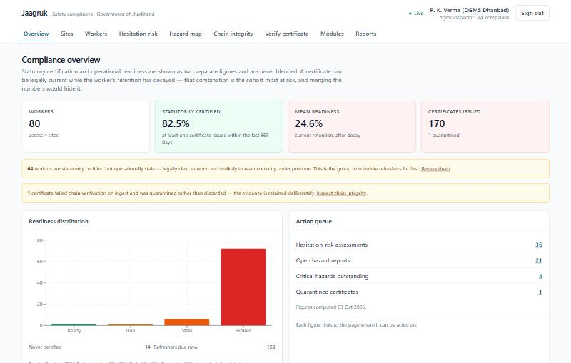
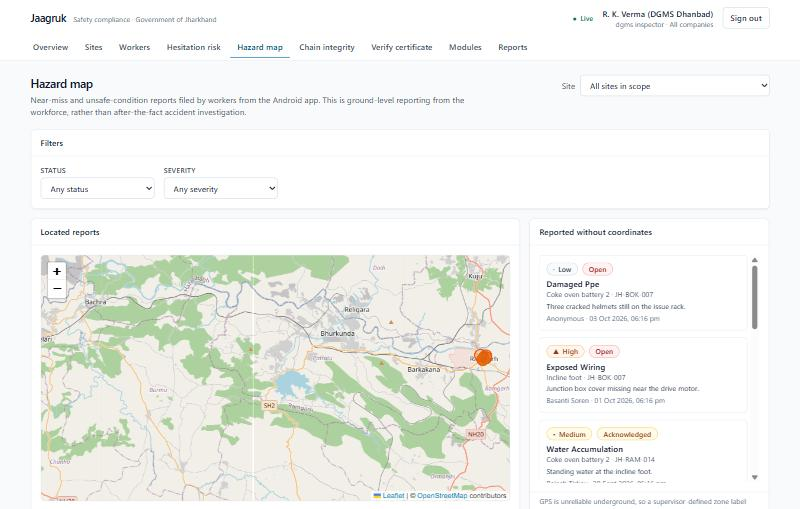
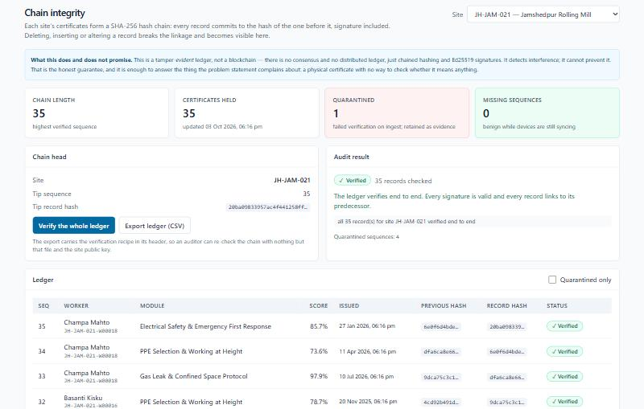
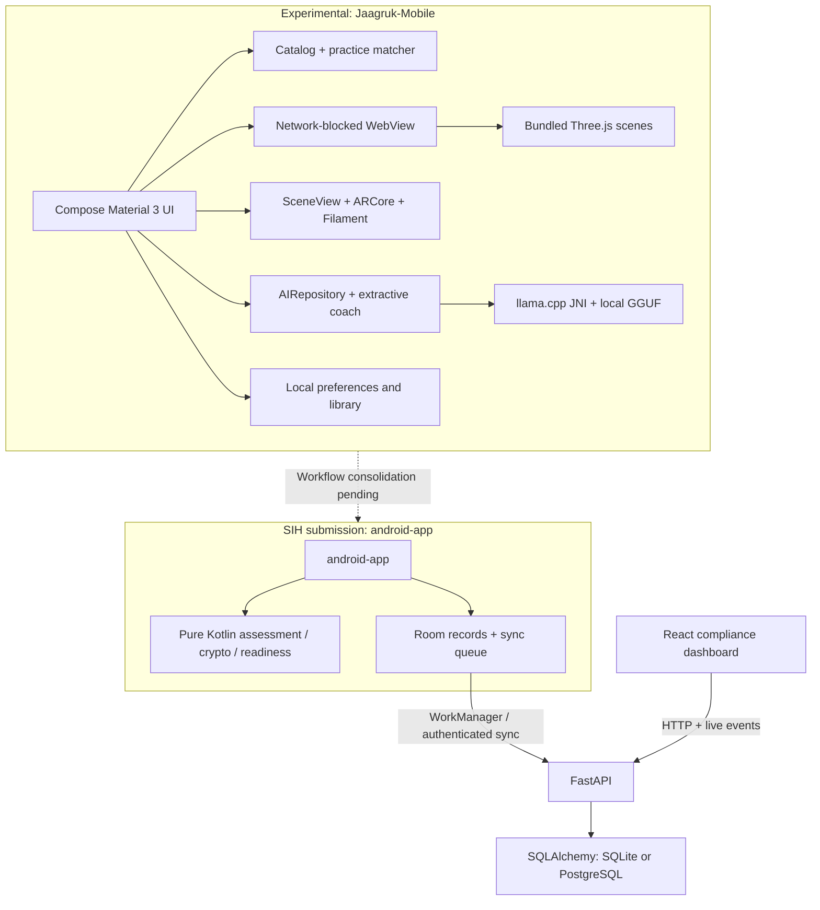
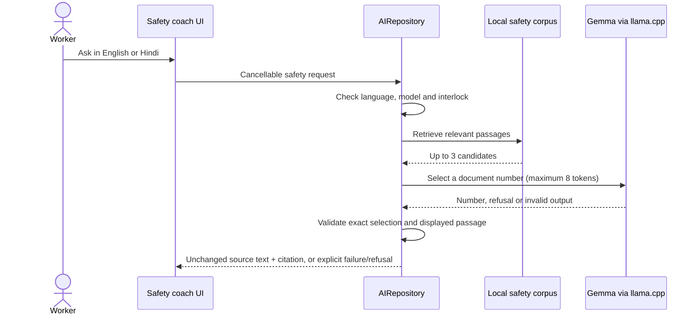
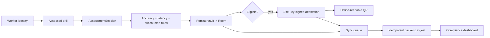
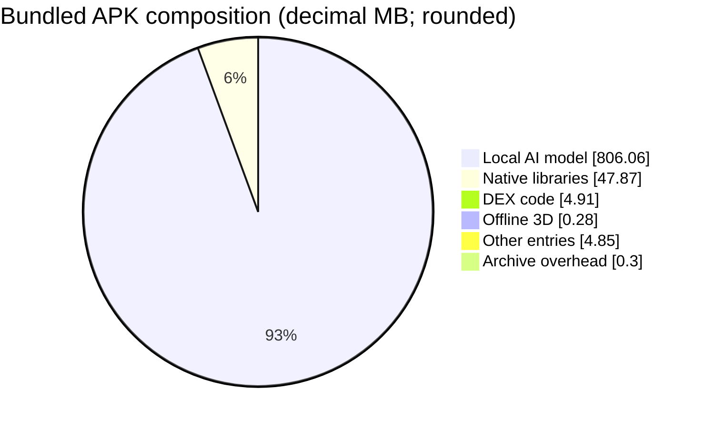
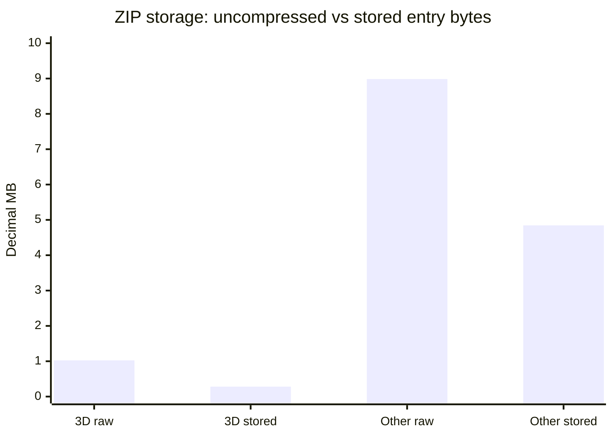

<div align="center">

# Jaagruk

### Offline-first safety training. Spatial practice. Source-grounded assistance.

A Kotlin Android project for vocational safety training in Jharkhand's mining and manufacturing sector, developed for **Smart India Hackathon · Problem Statement 26041**.

**Android 10+ · Timed assessment · Signed offline certificates · ARCore with fallbacks · Hindi + Santali**

**[Watch the demo video](https://youtu.be/B-6fgtAkHbg)** · **[Download the Android APK](https://github.com/palakrai573/Jaagruk-app/releases/latest)**

[Build the submission app](#1-sih-submission-app-android-app) · [Architecture](#architecture) · [Measured Results](#measured-results) · [Companion Web App](https://github.com/palakrai573/Jaagruk)

[](https://youtu.be/B-6fgtAkHbg)

</div>

**Installing the APK.** The [Releases page](https://github.com/palakrai573/Jaagruk-app/releases/latest) carries the submission app (`android-app`) built by CI, one APK per CPU type plus `SHA256SUMS`. Take **`arm64-v8a`** for almost any current phone (about 32 MiB), or `universal` if unsure. Android 10 or later. The files are named `debugkey` because they are signed with the debug key for sideloading rather than a store key — allow "install unknown apps" when Android asks.

> **Which app is the SIH 26041 submission:** the root `android-app`, with `backend/` and `dashboard/`. It is the one that runs the complete flow the problem statement asks for — worker sign-in, timed drills with hesitation scoring, Ed25519-signed QR certificates, offline QR verification, queued sync to the FastAPI backend, and ARCore with sensor and pictogram fallbacks. Build it from the [repository root](#1-sih-submission-app-android-app).
>
> `Jaagruk-Mobile/` is a separate, **experimental** Gradle project: an on-device safety-coach and 3D-practice prototype. It has no sign-in, assessment, certificate or sync workflow, so it is not the submission and should not be judged as one.
>
> **Status — 3 October 2026:** physical AR anchor stability, signed-release device acceptance and expert translation review remain outstanding.

## Contents

- [Product Overview](#product-overview)
- [Interface Gallery](#interface-gallery)
- [Choose the Right Project](#choose-the-right-project)
- [Capabilities & Training Modules](#capabilities--training-modules)
- [Architecture](#architecture)
- [How Training Works](#how-training-works)
- [How the Safety Coach Works](#how-the-safety-coach-works)
- [Assessment, Certificates & Compliance](#assessment-certificates--compliance)
- [Technology Stack](#technology-stack)
- [Offline & Language Behavior](#offline--language-behavior)
- [Measured Results](#measured-results)
- [Size, Compression & Efficiency](#size-compression--efficiency)
- [Implementation Comparisons](#implementation-comparisons)
- [Build & Run](#build--run)
- [Repository Map](#repository-map)
- [Limitations & Future Scope](#limitations--future-scope)
- [Documentation & Contribution](#documentation--contribution)

## Product Overview

Jaagruk makes safety procedures available for repeated practice on a smartphone: explore a local 3D scene, place illustrative props in the camera view, rehearse decisions, and consult relevant safety-library passages without requiring a cloud model.

The broader repository explores the administrative side of training as well: deterministic assessments, signed certificates, readiness tracking, delayed synchronization and an operator dashboard.

**The design principle:** keep learning available without sign-in or continuous connectivity, while keeping practice, AI assistance and certified assessment explicitly separate.

| Audience | Intended workflow | Current implementation boundary |
|---|---|---|
| New workers and trainees | Explore hazards, rehearse decisions, repeat a module | Submission app (public Explore/Practice) and Jaagruk-Mobile |
| Workers revising procedures | Ask an English/Hindi safety question and inspect its source | Jaagruk-Mobile (experimental); installed model required for selection |
| Trainers | Demonstrate an offline scene or camera-anchored tabletop model | Jaagruk-Mobile (experimental); physical placement acceptance pending |
| Safety supervisors | Review assessed records, readiness, hazards and certificates | Root assessment app, backend and dashboard |
| Verifiers | Scan a signed certificate and inspect verification status | Root assessment/compliance implementation |

This is a training prototype, **not a hazard detector, work permit, emergency-response authority or government-approved certification system**. Follow site procedures and qualified supervision.

## Interface Gallery

### Compliance dashboard — real screenshots

Captured on 3 October 2026 from the backend serving the built dashboard (`deploy/`), with the seeded demo dataset, signed in as the DGMS inspector.

<table>
  <tr>
    <td align="center" width="33%"></td>
    <td align="center" width="33%"></td>
    <td align="center" width="33%"></td>
  </tr>
  <tr>
    <td align="center"><strong>Statutory vs operational readiness</strong></td>
    <td align="center"><strong>Near-miss reports from the field</strong></td>
    <td align="center"><strong>Tamper evidence, verified in the browser</strong></td>
  </tr>
</table>

Screenshots of the Android submission app need a physical ARCore device and are not included yet.

### Experimental app — presentation visuals

<table>
  <tr>
    <td align="center" width="33%"></td>
    <td align="center" width="33%"></td>
    <td align="center" width="33%"></td>
  </tr>
  <tr>
    <td align="center"><strong>Source-grounded coach</strong></td>
    <td align="center"><strong>Explore, then practise</strong></td>
    <td align="center"><strong>Supporting learning tools</strong></td>
  </tr>
</table>

**Image provenance:** These depict the experimental `Jaagruk-Mobile` app. They are user-supplied presentation visuals in iPhone-style frames, not evidence of an iOS build or screenshots from the tested Samsung. Actual layouts and labels can differ. This repository's app implementation is Android/Kotlin.

The three supplied Tools PNGs are byte-identical, so the gallery displays one rather than repeating it. All originals remain available: [Tools](docs/Jaagruk%20Tools%20Screen%20on%20iPhone.png), [Tools (1)](docs/Jaagruk%20Tools%20Screen%20on%20iPhone%20%281%29.png), [Tools (2)](docs/Jaagruk%20Tools%20Screen%20on%20iPhone%20%282%29.png).

## Choose the Right Project

| Project | Open/build from | Role | Purpose |
|---|---|---|---|
| **`android-app`** | Repository root | **SIH submission** | Worker identity, assessed drills, signed QR certificates and verification, readiness, offline records and sync. Modules `:android-app`, `:ai`, `:core` |
| **Compliance backend** | `backend/` | **SIH submission** | Authentication, batch ingestion, records, verification and reports. Requires its own server/database configuration |
| **Compliance dashboard** | `dashboard/` | **SIH submission** | Browser-based oversight and reporting, backed by the API |
| **Jaagruk-Mobile** | `Jaagruk-Mobile/` | Experimental | Phone-tested 3D scenes, camera AR and an extractive on-device coach. Modules `:app`, `:ai`, `:core`; guest practice only — no sign-in, assessment or certificates |
| **Companion web training app** | [Separate repository](https://github.com/palakrai573/Jaagruk) | Product/UI reference and browser experience | Not the same project as this repository's compliance dashboard |

The two copies of `:core` and `:ai` are separate source trees; one is not automatically linked into the other. Passing tests in one tree does not validate the other. Their feature consolidation is future work.

**Published state:** the root app's locally tested changes — public Explore and Practice routes, drill pause, certificate replay, recorded narration and the device-scoped sync authorisation — are now committed. Re-run the relevant gates on your checkout before treating historical counts as release acceptance.

## Capabilities & Training Modules

### Capability matrix

| Capability | Jaagruk-Mobile (experimental) | `android-app` + backend + dashboard (submission) |
|---|---|---|
| Public training entry | Starts on training without sign-in | Public Explore and Practice routes; sign-in only for assessed drills |
| Five rehearsal modules | Implemented, including complete practice/restart flows | Catalog and guest practice implementation |
| Interactive offline 3D | Bundled Three.js scenes in a network-blocked WebView | Different presentation implementation; not the same scene bundle |
| Live camera AR | SceneView/ARCore plane placement and native props | ARCore controller with sensor/pictogram fallbacks |
| Assessed spatial interaction | Not connected to the experimental app's practice screen | Controller/session/repository implementation |
| Safety coach | Model selects an authored passage; exact text displayed | Retrieval, bounded generation and answer guard |
| Signed QR certificates | Not exposed as a completed mobile workflow | Core codec, signing, verification and Android screens |
| Backend synchronization | Do not infer a complete workflow from data-layer classes | WorkManager queue and FastAPI ingestion |
| Administration | Not an in-app compliance dashboard | React dashboard and API |
| General learning tools | Chat, OCR, document/screenshot tools and Circle Learn | Separate safety-focused UI |
| Complete field acceptance | Not yet | Not yet |

### Five training domains

| Module ID | Domain | Learning focus | Active camera props |
|---|---|---|---|
| `fire-evacuation` | Fire and explosion response | Alarm, evacuation and extinguisher-related decisions | Extinguisher and exit |
| `gas-confined-space` | Gas and confined spaces | Entry precautions, PPE and buddy procedures | Vessel and detector |
| `machinery-loto` | Machinery and isolation | Lockout/tagout and safe intervention sequence | Conveyor and isolator |
| `ppe-height` | PPE and work at height | Protection selection and fall-prevention decisions | Raised platform and anchor |
| `electrical-first-response` | Electrical safety | Isolation and electrical hazard decisions | Panel and cable |

See the [module catalog](Jaagruk-Mobile/core/src/main/kotlin/org/jaagruk/core/catalog/ModuleCatalog.kt) for actual scenarios and answer definitions. Scene props are illustrative, not a complete depiction of every procedure.

## Architecture

### Two application paths, one product direction


```mermaid
flowchart TB
    subgraph MOBILE["Experimental: Jaagruk-Mobile"]
        UI["Compose Material 3 UI"]
        PRACTICE["Catalog + practice matcher"]
        WEBVIEW["Network-blocked WebView"]
        THREE["Bundled Three.js scenes"]
        AR["SceneView + ARCore + Filament"]
        COACH["AIRepository + extractive coach"]
        ENGINE["llama.cpp JNI + local GGUF"]
        LOCAL["Local preferences and library"]
        UI --> PRACTICE
        UI --> WEBVIEW --> THREE
        UI --> AR
        UI --> COACH --> ENGINE
        UI --> LOCAL
    end

    subgraph COMPLIANCE["SIH submission: android-app"]
        APP["android-app"]
        CORE["Pure Kotlin assessment / crypto / readiness"]
        ROOM["Room records + sync queue"]
        APP --> CORE
        APP --> ROOM
    end

    ROOM -->|"WorkManager / authenticated sync"| API["FastAPI"]
    API --> DB["SQLAlchemy: SQLite or PostgreSQL"]
    DASH["React compliance dashboard"] -->|"HTTP + live events"| API
    MOBILE -. "Workflow consolidation pending" .-> COMPLIANCE
```

### Key components and ownership

| Component | Responsibility | Source |
|---|---|---|
| Navigation | Public startup and routes into simulation, practice, AR and tools | [AppNavigation.kt](Jaagruk-Mobile/app/src/main/java/org/jaagruk/safety/ui/navigation/AppNavigation.kt) |
| Offline scene host | Local assets, lifecycle pause/resume, renderer commands and blocked network requests | [SimulationScreen.kt](Jaagruk-Mobile/app/src/main/java/org/jaagruk/safety/ui/screens/SimulationScreen.kt) |
| Camera practice | Permission, AR session, horizontal-plane hit testing, anchoring and prop lifecycle | [CameraArScreen.kt](Jaagruk-Mobile/app/src/main/java/org/jaagruk/safety/ui/screens/CameraArScreen.kt) |
| Safety request owner | Serializes coach requests and checks displayed text against retrieved passages | [AIRepository.kt](Jaagruk-Mobile/app/src/main/java/org/jaagruk/safety/ai/repository/AIRepository.kt) |
| Extractive selection | Turns a bounded model selection into an unchanged source passage | [ExtractiveSafetyCoach.kt](Jaagruk-Mobile/ai/src/main/java/org/jaagruk/ai/ExtractiveSafetyCoach.kt) |
| Native inference | JNI bridge and vendored CPU inference backend | [Native AI sources](Jaagruk-Mobile/ai/src/main/cpp) |
| Assessment rules | Exact answer matching, latency scoring and outcome aggregation | [ScoreCalculator.kt](core/src/main/kotlin/org/jaagruk/core/assessment/ScoreCalculator.kt) |
| Certificate encoding | Canonical signed payload and compact QR representation | [QrCodec.kt](core/src/main/kotlin/org/jaagruk/core/cert/QrCodec.kt) |
| Sync ingestion | Idempotent batches, per-item outcomes and additive records | [sync.py](backend/app/services/sync.py) |

**Why a pure Kotlin core?** Scenario rules, scoring, certificate encoding and readiness arithmetic can be tested without Android, a camera, a GPU or a running backend. Android owns device lifecycle and input; the core owns deterministic decisions.

## How Training Works


```mermaid
flowchart LR
    OPEN["Open app"] --> HOME["Public training home"]
    HOME --> LANG["Choose language"]
    LANG --> MODULE["Choose module"]
    MODULE --> SCENE["Explore offline 3D"]
    SCENE --> PRACTICE["Answer practice decisions"]
    SCENE --> CAMERA["Open Camera AR"]
    CAMERA --> PERMISSION["Permission + compatible AR runtime"]
    PERMISSION --> SCAN["Scan horizontal surface"]
    SCAN --> PLACE["Place anchored props"]
    PLACE --> PRACTICE
    PRACTICE --> FEEDBACK["Authored feedback"]
    FEEDBACK --> REPEAT["Complete or restart"]
```

### Offline 3D rendering

The scene source lives under [simulation/](Jaagruk-Mobile/simulation). React Three Fiber and Three.js are bundled by esbuild into `app/src/main/assets/simulation/`. The native UI hosts the local page in a WebView and sends scene actions through a JavaScript command bridge.

The host blocks network loading, disallows universal file-URL access and rejects navigation away from the scene asset. The scene responds to orbit, actions, pause and reset. Activity lifecycle changes pause/resume rendering; leaving the view destroys the WebView.

This is **interactive 3D**, not camera tracking. The separate **Camera AR** entry starts the native AR path.

### Native camera AR

1. Request camera permission and acquire the AI/AR memory interlock.
2. Start a lifecycle-bound ARCore session through SceneView.
3. Wait for camera tracking and an upward-facing horizontal plane.
4. Hit-test the viewport centre against a tracked plane.
5. Create an ARCore anchor and attach metre-scaled cube/cylinder props.
6. Keep the camera visible while the existing decision-practice UI is shown.
7. Reset detaches the anchor and destroys prop nodes; leaving AR releases the interlock.

The current models are procedural tabletop representations, not photorealistic characters or reconstructed industrial sites. Practice answers still use decision controls: object picking, timed spatial assessment and certified AR gestures are not implemented in this screen.

## How the Safety Coach Works

The experimental app's coach uses the model as a **document selector**, not as an unrestricted author of safety instructions.


```mermaid
sequenceDiagram
    actor Worker
    participant UI as Safety coach UI
    participant Repo as AIRepository
    participant Corpus as Local safety corpus
    participant Model as Gemma via llama.cpp
    Worker->>UI: Ask in English or Hindi
    UI->>Repo: Cancellable safety request
    Repo->>Repo: Check language, model and interlock
    Repo->>Corpus: Retrieve relevant passages
    Corpus-->>Repo: Up to 3 candidates
    Repo->>Model: Select a document number (maximum 8 tokens)
    Model-->>Repo: Number, refusal or invalid output
    Repo->>Repo: Validate exact selection and displayed passage
    Repo-->>UI: Unchanged source text + citation, or explicit failure/refusal
```

### Guardrails implemented in the experimental app's coach

- Language-scoped retrieval grounds the request in the bundled corpus.
- Only the top three candidates enter the selector prompt.
- Generation uses greedy sampling and an eight-token budget.
- `0` means refusal; only a standalone valid candidate number is accepted.
- Cancellation, token-limit termination and malformed selections are rejected.
- Displayed answer text comes from the selected passage, not a generated paraphrase.
- The repository applies an additional exact-passage display check.
- AR entry releases model resources through the session interlock.
- Stopping, leaving or backgrounding the coach cancels its request.

This limits generated safety prose, but **does not prove retrieval relevance, corpus correctness or suitability for a particular mine**. A model can select the wrong authored passage. The small regression evaluation is not a comprehensive safety benchmark.

The root project's [AiCoach](ai/src/main/java/org/jaagruk/ai/AiCoach.kt) follows a different retrieval/prompt/guard pipeline. Its tests and behavior must not be attributed to the experimental app's extractive coach.

### General tools are a different trust boundary

OCR, document summaries, screenshot explanation, Circle Learn and general chat are learning aids. Their outputs do not inherit the safety coach's exact-passage guarantee, do not establish permit conditions and cannot issue certificates. Voice recognition availability depends on the device/service; fully offline speech is not established for every language.

## Assessment, Certificates & Compliance

**This section describes the root assessment project, the submission app's workflows, not the experimental app's practice screen.**


```mermaid
flowchart LR
    ID["Worker identity"] --> DRILL["Assessed drill"]
    DRILL --> SESSION["AssessmentSession"]
    SESSION --> SCORE["Accuracy + latency + critical-step rules"]
    SCORE --> RESULT["Persist result in Room"]
    RESULT --> ELIGIBLE{"Eligible?"}
    ELIGIBLE -->|"yes"| SIGN["Site-key signed attestation"]
    SIGN --> QR["Offline-readable QR"]
    RESULT --> QUEUE["Sync queue"]
    SIGN --> QUEUE
    QUEUE --> SERVER["Idempotent backend ingest"]
    SERVER --> DASHBOARD["Compliance dashboard"]
```

### Deterministic scoring

Answer matching rejects unknown options and duplicates. Ordered steps require the exact sequence; unordered steps require the exact answer set. There is no partial credit for an incomplete option set.

For a correct decision, the core uses:

```text
step score = 0.70 + 0.30 × latency factor
latency factor = 1 at/before the expert baseline
                 0 at/after the timeout
                 linear interpolation between them
wrong answer = 0
```

Completion and certification eligibility are separate from the numeric score. Narration, tracking loss and background interruptions are handled by the assessment lifecycle, rather than automatically treating every elapsed millisecond as hesitation.

Readiness is computed locally from prior performance and refresher state. It is an implemented scheduling heuristic, **not a validated prediction of accident risk or a statutory validity determination**.

### Compact signed certificates

| Property | Implementation |
|---|---|
| Signature | Ed25519 |
| Encoding | Canonical binary payload, Base64URL text with `JGK1:` prefix |
| Fixture size | **158 binary bytes → 216 text characters**, asserted in the QR codec test |
| Binary ceiling | 512 bytes |
| Chain | Per-site hash-linked records |
| Offline prerequisite | Locally trusted site public key; chain context determines linkage confidence |
| Important limit | A valid signature authenticates a signed record, not competence or regulatory approval |

Verification distinguishes malformed input, unknown site key, bad signature, broken link, sequence gap, signature-valid/chain-unknown and verified linkage. Offline verification cannot discover revocations or records that have never reached the device.

See [certificate tests](core/src/test/kotlin/org/jaagruk/core/cert/QrCodecTest.kt), [chain verification](core/src/main/kotlin/org/jaagruk/core/crypto/ChainVerifier.kt) and [calibration guidance](docs/CALIBRATION.md).

### Backend and dashboard

The backend uses FastAPI, SQLAlchemy and a configurable database. Sync ingestion uses a device/batch identifier for replay handling, reports results per item and does not provide a client-driven history rewrite path.

The dashboard includes overview, workers, sites, modules, readiness/hesitation views, hazards, chain integrity, verification and reports. These pages require a configured API and appropriate access. Seeded demonstrations are not production records.

## Technology Stack

| Layer | Jaagruk-Mobile implementation / repository stack |
|---|---|
| Android UI | Kotlin 2.0.21, Jetpack Compose, Material 3, Navigation Compose |
| Build | AGP 8.10.1, Gradle wrapper, JDK 17; compile/target SDK 36; minimum SDK 29 |
| Camera AR | SceneView 2.3.0, ARCore 1.47.0, Filament |
| Offline 3D | Three.js 0.170.0, React 18.3.1, React Three Fiber 8.18.0, Drei 9.122.0 |
| Scene packaging | esbuild 0.25.12; bundled local HTML/JavaScript |
| On-device inference | Gemma 3 1B IT Q4_K_M GGUF, llama.cpp CPU backend, JNI/C++ |
| State and persistence | Coroutines, StateFlow, DataStore; Room in repository data layers |
| Android services | WorkManager, CameraX, ML Kit; capabilities depend on the workflow |
| Root compliance API | Python, FastAPI 0.115.6, SQLAlchemy 2.0.36, Alembic, Pydantic |
| Database | SQLite for local development; PostgreSQL configuration available |
| Dashboard | React 18, TypeScript, Vite, TanStack Query, Recharts, Leaflet |
| Cryptography / QR | Ed25519, canonical codecs, hash chains, ZXing |
| Testing | JUnit, MockK, Robolectric, Compose instrumentation, backend pytest |

Version references: [mobile catalog](Jaagruk-Mobile/gradle/libs.versions.toml), [scene dependencies](Jaagruk-Mobile/simulation/package.json), [backend requirements](backend/requirements.txt), [dashboard package](dashboard/package.json). The root Android project's version catalog is independent.

## Offline & Language Behavior

| Capability | Offline behavior | Prerequisites / limits |
|---|---|---|
| Training catalog and decisions | Bundled locally | No sign-in required for active-app practice |
| Three.js scenes | Bundled locally; scene network requests blocked | Working Android WebView/WebGL |
| Native camera AR | Local props and tracking | Compatible device and installed Google Play Services for AR; initial setup may require network |
| Safety coach | Local retrieval and local inference | Valid installed/extracted model and sufficient memory |
| General voice recognition | Device/service-dependent | Do not assume offline support |
| Root QR verification | Local cryptographic verification | Trusted site key and available chain data |
| Root synchronization | Queued locally, transmitted later | Network, configured API and authentication |
| Dashboard | Server-backed | API connectivity |

### Locale coverage in Jaagruk-Mobile

| Language | Training resources | In-app selection | Safety coach |
|---|---|---|---|
| English | Present | Persistent | Supported |
| Hindi | Present | Persistent | Supported |
| Santali / Ol Chiki | Present; new translations need review | Persistent | Unsupported, explicitly reported |
| Tamil | Present; translations need review | Persistent | Unsupported, explicitly reported |

The resource check finds **359 keys per locale** and matching format arguments. That establishes resource parity, not translation quality. Some inherited tool/general-chat screens still contain English literals. Do not interpret these counts as universal localization or speech coverage.

## Measured Results

### Evidence, not a combined score

These are **recorded results from different suites/builds**, not a fresh full-system run performed for this README. Counts must not be summed into a claim of unique tests: the projects share substantial logic.

| Scope | Recorded result | What it establishes |
|---|---|---|
| Jaagruk-Mobile core | 608 tests; zero failures/errors | JVM logic regression coverage |
| Jaagruk-Mobile AI unit suite | 72 tests; zero failures/errors | Scripted-engine orchestration, not broad real-model accuracy |
| Jaagruk-Mobile physical-device UI | 33 tests in 113.153 s | Samsung SM-S721B / Android 16; camera startup, scenes, locales and navigation |
| Practice coverage within that UI run | 20 completed flows | Five modules × four locales |
| Active real-model evaluation | Five nominal English/Hindi selections plus refusal/unsupported checks; 70.451 s total | Small device regression run, not an accuracy percentage |
| Earlier model run, 30 September | 5.3–11.6 s per nominal answer | Observed range for that run only; not p95 or a cross-device benchmark |
| Locale audit | 359 keys in each of four locales | Key and format-signature parity |
| Recorded debug lint | Zero errors; 47 warnings | Static checks, not absence of defects |
| Root core / AI / Android suites | 606 / 57 / 137 tests; zero failures/errors in retained reports | Separate project's recorded JVM/unit results |
| Latest logo release build | Successful; APK v2 signature and ZIP alignment verified | Build/package validation, not a phone acceptance run |
| Native release alignment | All 20 ARM64/x86_64 libraries passed 16 KB ELF checks | Packaged native segment alignment |

Sources: [mobile validation](Jaagruk-Mobile/docs/VALIDATION.md), [dated mobile execution history](Jaagruk-Mobile/docs/WEB-PARITY.md), [root native verification](docs/NATIVE-EXPERIENCE.md#automated-verification-30-september-2026). Existing local JUnit XML reports were inspected for the JVM/unit counts; they are generated artifacts, not committed evidence bundles.

The 1 October camera tests establish live sessions with advancing frames. They **do not** establish reliable physical placement while walking around a surface. The signed release, including the logo-only rebuild, still needs physical-device acceptance.

No measured FPS, peak RAM, battery consumption, crash-free rate, fleet-scale throughput or learning-retention improvement is claimed.

## Size, Compression & Efficiency

### Latest local bundled release

Measured directly from the signed APK archive on **1 October 2026**, after the launcher-logo update. Decimal MB below means 1,000,000 bytes.

| Entry group | Uncompressed bytes | Stored bytes | Stored MB |
|---|---:|---:|---:|
| GGUF model | 806,058,240 | 806,058,240 | 806.06 |
| Native libraries | 47,874,880 | 47,874,880 | 47.87 |
| DEX code | 4,913,548 | 4,913,548 | 4.91 |
| Offline 3D assets | 1,024,750 | 281,051 | 0.28 |
| Other archive entries | 8,984,814 | 4,845,292 | 4.85 |
| ZIP headers, alignment and signing overhead | — | 298,726 | 0.30 |
| **Complete APK** | — | **864,271,737** | **864.27** |


```mermaid
pie showData
    title Bundled APK composition (decimal MB; rounded)
    "Local AI model" : 806.06
    "Native libraries" : 47.87
    "DEX code" : 4.91
    "Offline 3D" : 0.28
    "Other entries" : 4.85
    "Archive overhead" : 0.30
```

The model accounts for approximately **93.3%** of the APK. This is a bundled, two-ABI release, not the historical model-free root app. Older 32 MB figures describe a different artifact and must not be used for this APK.

### What actually compresses


```mermaid
xychart-beta
    title "ZIP storage: uncompressed vs stored entry bytes"
    x-axis ["3D raw", "3D stored", "Other raw", "Other stored"]
    y-axis "Decimal MB" 0 --> 10
    bar [1.02475, 0.281051, 8.984814, 4.845292]
```

- Offline 3D entry bytes are **72.57% smaller** when stored in this APK.
- Other archive entries are **46.07% smaller**.
- Model, native libraries and DEX are stored without ZIP size reduction in this artifact.
- Q4_K_M describes model quantization; it is **not** evidence of a measured fourfold reduction against an FP16 build. No matched FP16 baseline was measured.
- R8 and resource shrinking are enabled, but no controlled before/after R8 comparison is available for this exact release.

The chart compares entry storage, not app speed, model quality or total installed footprint. First-use model extraction adds another model-sized file: APK plus extracted weights alone account for about **1.67 GB**, before installation overhead, caches and user data.

### Packaging choices

| Choice | Benefit | Cost / boundary |
|---|---|---|
| Bundled flavor | Model available from the installation package | Large transfer and model extraction space |
| Lean flavor | Does not package the GGUF | Model must be provisioned separately; not feature-equivalent on first launch |
| Local lexical retrieval | No extra embedding model in the coach pipeline | Relevance depends on vocabulary and corpus coverage |
| Eight-token document selection | Bounded generation and no generated safety passage | Retrieval/selection can still be wrong |
| AI/AR interlock | Avoids intentionally keeping both workloads active | Switching can require unloading/reloading |
| Prebundled scene JavaScript | No runtime CDN dependency | Assets must be rebuilt to publish scene changes |
| Compact QR fixture | 158-byte signed fixture, locally verifiable | Payload length can vary; trusted keys still required |

Artifact identity:

```text
Package:    org.jaagruk.safety.release
Version:    1.0-bundled (code 1)
APK bytes:  864271737
SHA-256:    76089DAC90BEFA003DC3BC5BEC1BFAE9616B09F3FFA99A8E9D0D56D1F9D730D9
```

The earlier artifact in the historical validation note has a different hash and size. This README identifies the **logo-updated release**. That paragraph describes the experimental `Jaagruk-Mobile` bundled build, which is not hosted: its APK, model weights and signing material are not committed. The submission app's APKs are the ones on the [Releases page](https://github.com/palakrai573/Jaagruk-app/releases/latest).

## Implementation Comparisons

These are **comparisons of code paths and design tradeoffs**, not independently measured competitor benchmarks.

| Dimension | Offline 3D practice | Native camera practice | Root assessed drill |
|---|---|---|---|
| Renderer | Three.js in local WebView | SceneView / Filament / ARCore | Root AR controller and fallback stack |
| Real camera tracking | No | Yes, on compatible devices | Controller-dependent |
| Entry requirement | Local scene support | Camera permission and AR runtime | Worker/assessment workflow prerequisites |
| Response input | Decision controls | Decision controls alongside anchored scene | Assessment input pipeline |
| Result | Practice feedback | Practice feedback | Recorded assessment outcome |
| Certificate path | None | None | Eligibility-controlled signing path |
| Main validation gap | Broader device coverage | Physical anchor/interaction acceptance | End-to-end field acceptance |

| Decision | Current approach | Alternative and tradeoff |
|---|---|---|
| Safety answer presentation | Exact authored passage in active coach | Free-form generation is more flexible but adds generated-content risk |
| Model hosting | Local GGUF | A hosted model shifts compute off-device but adds network/service dependence |
| Certificate representation | Signed compact payload | A lookup-only QR relies on a reachable record service |
| Offline persistence | Local records plus later sync in root app | Server-only writes cannot complete without connectivity |
| Scene distribution | APK assets | Remote assets reduce initial packaging but require download/version handling |

No claims are made that Jaagruk outperforms commercial simulators, reduces accidents by a percentage or replaces accredited instruction.

## Build & Run

### Prerequisites

- JDK 17 and the committed Gradle wrapper.
- Android SDK platform 35 (submission app) and 36 (experimental app), plus the NDK and CMake: both `:ai` modules build vendored llama.cpp natively.
- Android Studio or a configured SDK via `local.properties`, `ANDROID_HOME` or `ANDROID_SDK_ROOT`.
- Node.js/npm for scene and dashboard builds; Python 3.11 is used by the backend helper.
- A compatible ARCore device for camera practice; sufficient free space for a bundled APK and model extraction.

Keep model licences, signing credentials, SDK paths and deployment secrets out of Git.

### 1. SIH submission app (`android-app`)

From the repository root:

```powershell
.\gradlew.bat :core:test :ai:testDebugUnitTest :android-app:testDebugUnitTest :android-app:assembleDebug
```

For a release build, pass a keystore — without one, `assembleRelease` deliberately signs with the debug key so the APK still sideloads:

```powershell
.\gradlew.bat :android-app:assembleRelease `
  -Pjaagruk.keystorePath=<path> -Pjaagruk.keystorePassword=<pw> -Pjaagruk.keyAlias=<alias> -Pjaagruk.keyPassword=<pw> `
  -Pjaagruk.releaseApiBaseUrl=https://<your-backend>/
```

ABI splits produce one APK per architecture plus a universal one under `android-app/build/outputs/apk/release/`. The release sync endpoint has **no real default**: until `jaagruk.releaseApiBaseUrl` is set it points at `https://sync.invalid/`, a reserved name that never resolves, so records stay queued on the phone rather than going anywhere unintended. See [native experience](docs/NATIVE-EXPERIENCE.md) for the public entry, model import, request lifecycle and verification boundaries.

### 2. Experimental assistant app (`Jaagruk-Mobile`)

Run from **Jaagruk-Mobile**, not the repository root:

```powershell
cd Jaagruk-Mobile
.\gradlew.bat :core:test :ai:testDebugUnitTest :app:assembleLeanDebug --max-workers=2
powershell -ExecutionPolicy Bypass -File tools/check-strings.ps1
```

The lean build has no bundled model. For the bundled release, obtain the appropriate licensed model separately and place it at:

```text
app/src/bundled/assets/models/gemma-3-1b-it-Q4_K_M.gguf
```

Create a signing identity **once**, then reuse it:

```powershell
# First release only; refuses to overwrite an existing identity.
powershell -ExecutionPolicy Bypass -File tools/build-release.ps1 -CreateSigningKey

# Subsequent releases.
powershell -ExecutionPolicy Bypass -File tools/build-release.ps1
```

Standard output: `app/build/outputs/apk/bundled/release/app-bundled-release.apk`. The script supports `-BuildDirectory` for relocated output. On Windows, cross-drive builds use an `app/.release-build` junction to satisfy generated-source path constraints.

Signing credentials live in local `.signing/`; the encrypted password is tied to its Windows account. Back up the signing identity securely before distribution. Debug and release use different package IDs and do not share app data.

Validate a built APK:

```powershell
.\tools\check-apk.ps1 -Apk "<path-to-apk>" -BuildTools "<sdk>/build-tools/36.0.0"
```

See [release delivery](Jaagruk-Mobile/docs/AR-AND-RELEASE.md).

### 3. Rebuild the experimental app's offline scenes

From `Jaagruk-Mobile/simulation`:

```powershell
npm ci
npm run build
```

The output goes directly into Android's simulation assets. Rebuild the APK afterward.

### 4. Backend and compliance dashboard

Use separate terminals from the repository root:

```powershell
.\tools\run-backend.ps1
```

```powershell
.\tools\run-dashboard.ps1
```

Backend default: `http://127.0.0.1:8000`; API documentation: `/docs`; dashboard default: `http://localhost:5173`.

To run or host both as **one service on one origin** — the backend serving the built dashboard — use the `Dockerfile` at the repository root, or deploy the [`render.yaml`](render.yaml) blueprint for a public demo with seeded logins. See [deploy/README.md](deploy/README.md).

The backend helper's `-Seed` option **drops and recreates tables**. Use it only with a disposable demo database, never existing records.

Configure deployment settings using [backend/.env.example](backend/.env.example). SQLite is the local default; PostgreSQL dependencies are separate. Replace secrets and demo credentials, configure allowed origins and HTTPS, and set the Android API base URL explicitly. The government-style hostname still used as the default certificate **verification** URL (`JAAGRUK_VERIFY_BASE_URL`) is **not** a deployed endpoint or an endorsement — set it to a host you control before issuing certificates outside a demo.

### 5. Verification commands

| Scope | Command / location |
|---|---|
| Submission app unit/build checks | Commands in step 1 |
| Experimental app unit/build checks | Commands in step 2 |
| Experimental app UI tests on connected target | `gradlew.bat :app:connectedLeanDebugAndroidTest` from `Jaagruk-Mobile`; provision the model for real-model tests |
| Experimental app release package | `tools/check-apk.ps1` |
| Dashboard | `npm ci`, then `npm run build` in `dashboard` |
| Backend | Install its runtime/test requirements, then run `pytest` from `backend` |

Check connected targets before instrumentation so results are attributed to the intended device. Unit tests with scripted inference must never be reported as real-model evaluation.

## Repository Map

```text
Jaagruk-app/
├── README.md
├── Jaagruk-Mobile/             Experimental, independent Android Gradle project
│   ├── app/                   Compose UI, resources, local scene assets
│   ├── ai/                    Extractive coach, engine, JNI and llama.cpp
│   ├── core/                  Pure Kotlin rules and safety corpus
│   ├── simulation/            Three.js scene source and bundler
│   ├── tools/                 Build, locale and APK validation helpers
│   └── docs/                  Mobile architecture and recorded validation
├── android-app/               SIH submission Android app (assessment, certificates, sync)
├── ai/                        Root project's AI integration
├── core/                      Root assessment, crypto, retrieval and speech logic
├── backend/                   FastAPI, models, migrations and tests
├── dashboard/                 React/TypeScript compliance application
├── docs/                      Architecture, API, calibration and presentation images
└── tools/                     Root build/demo/verification helpers
```

Historical documents can describe earlier phases. Prefer current source and dated evidence over older milestone text, especially for camera AR, locale counts and APK sizes.

## Limitations & Future Scope

### Current limits

- **Integration:** The submission app and the experimental `Jaagruk-Mobile` app are separate projects with separately maintained copies of `:core` and `:ai`. A class or dependency in one tree does not establish a feature in the other.
- **AR:** Camera startup is tested; physical anchor stability and in-camera interaction acceptance remain pending. No real gas, fire, electrical or PPE recognition is claimed.
- **Safety content:** Corpus passages and translations require industrial-safety review. Draft Santali/Tamil text is not deployment-approved.
- **AI:** English/Hindi only in the safety coach. General tools are not safety-validated, and five nominal model questions do not establish comprehensive quality.
- **Devices:** The reported physical-device run is one Samsung on Android 16. Android 10 support is a build target, not proof of every Android 10 handset working.
- **Release:** Signature and native alignment passed, but the signed release's fresh-install extraction, R8/JNI runtime and complete phone walkthrough remain unverified.
- **Speech:** Device recognition, narration and noisy-site speech require independent validation. Root MFCC/DTW keyword work is not general Santali speech recognition.
- **Certification:** Prototype signed records are not legally recognized credentials by virtue of their cryptography.
- **Operations:** No production-scale load, retention improvement, offline multi-device field trial or independent security audit is claimed.

### Prioritized next work

| Priority | Deliverable | Acceptance evidence |
|---|---|---|
| 1 | Physical AR and signed-release acceptance | Placement/movement tests, permission recovery, cold offline launch and model extraction on named devices |
| 2 | Reviewed translations and safety corpus | Native-speaker and industrial-safety sign-off, including Santali terminology |
| 3 | Consolidate training and compliance workflows | One documented app path from worker identity through assessment, certificate and sync |
| 4 | Broaden model evaluation | Reviewed multilingual question set, wrong-source analysis, refusals and reproducible timing |
| 5 | Profile representative devices | FPS, peak memory, thermal/battery behavior and storage measurements |
| 6 | Harden deployment | Secret/key management, revocation policy, access review, backups and sync-conflict testing |
| 7 | Improve scenario fidelity | Tested spatial interaction and richer assets without weakening offline accessibility |

These are planned directions, not completed features.

## Documentation & Contribution

| Read next | Purpose |
|---|---|
| [Experimental app overview](Jaagruk-Mobile/README.md) | `Jaagruk-Mobile` entry point |
| [Camera AR and release delivery](Jaagruk-Mobile/docs/AR-AND-RELEASE.md) | Native camera lifecycle, language and signing boundaries |
| [Mobile validation](Jaagruk-Mobile/docs/VALIDATION.md) | Recorded device results and remaining acceptance |
| [Mobile execution history](Jaagruk-Mobile/docs/WEB-PARITY.md) | Dated changes and earlier regression runs |
| [Root architecture](docs/ARCHITECTURE.md) | Assessment/compliance design |
| [Root native experience](docs/NATIVE-EXPERIENCE.md) | Root app workflow and request lifecycle |
| [API reference](docs/API.md) | Backend interfaces |
| [Calibration](docs/CALIBRATION.md) | Scoring/readiness calibration assumptions |
| [Edge cases](docs/EDGE_CASES.md) | Failure handling and boundaries |
| [Submission checklist](docs/SUBMISSION_CHECKLIST.md) | Demonstration and delivery planning |

When contributing, identify the project you changed, keep practice separate from assessed records, add tests at the owning layer, and document the exact device/build/model behind any performance claim. Do not commit model weights, signing keys, private device captures or production credentials.

This repository's own code is released under the [MIT licence](LICENSE). Third-party code and model weights retain their own licences — the vendored llama.cpp notice is in [its source directory](Jaagruk-Mobile/ai/src/main/cpp/llama/LICENSE), and model weights are never committed.

---

**Jaagruk is a training aid built around explicit evidence:** what runs, what was tested, what remains uncertain, and what must be reviewed before field use.
