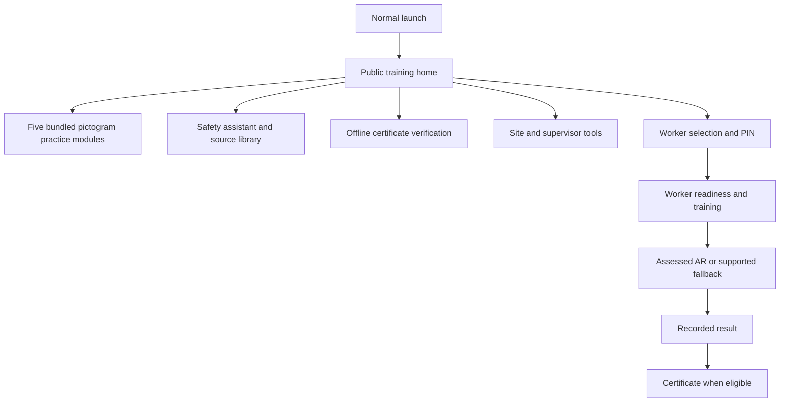
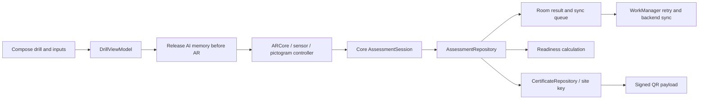
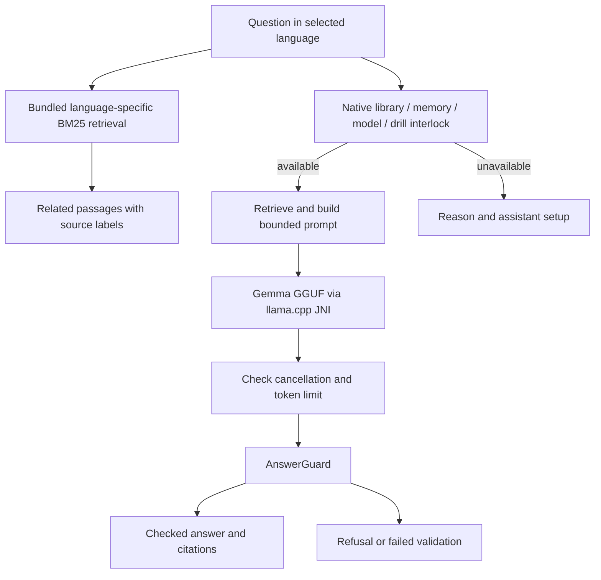

# Native experience and execution pipeline

The Kotlin app and [web app](https://github.com/palakrai573/Jaagruk) share a product flow: open training first, identify a worker when recording assessed work, and keep training usable offline. They are separate implementations, not a WebView wrapper.

## Entry and identity

`ExploreScreen` has no repository dependencies. Guest `PracticeScreen` reads `ModuleCatalog` and compares decisions using the same `AnswerMatcher` used by assessments. It supports single choices, multiple selections and ordered actions, with authored remediation after each decision. Its state survives configuration recreation through `rememberSaveable`.

Guest practice is untimed and uses pictograms, including for spatial decisions. It does not claim to be AR, measure hesitation, create a worker, write an assessment, alter readiness or produce a certificate. Choose worker sign-in for the existing assessed AR pipeline. Refresher notifications retain their worker-specific destination. Signing out returns to the public home.

Worker sign-in has a visible back control that returns to the previous training screen without choosing a worker or authenticating. Its heading identifies the task as worker sign-in instead of repeating the product name.

## Assessment and offline records

The UI cannot set AR evidence flags directly. The achieved presentation is recorded by the existing controller path. Tracking loss, narration and background interruptions pause assessment timing. Persistence and certificate eligibility remain owned by the repositories and core engine.

## AI pipeline

`AskViewModel` owns one cancellable request. Duplicate submits cannot start parallel requests. Editing a question, stopping, leaving the screen, backgrounding the app or clearing the view model cancels it. Request identifiers prevent delayed token callbacks from replacing a newer question. The UI exposes progress counts, never unchecked partial model text.

Supervisor shift briefings also own one cancellable request. Stop, screen disposal and backgrounding cancel generation; completed drafts remain visible. Request identifiers reject stale progress after cancellation or retry. Fact-collection and inference failures show a retryable failure instead of leaving the panel working indefinitely. Briefings remain drafts for supervisor review, not operational instructions approved by the app.

Related source passages remain available without a model and are explicitly labelled as source material, not a generated answer. They do not substitute for site procedures. Cancelled generation is rejected; output stopped by the token budget is marked incomplete. Neither source retrieval nor generation can issue a certificate or change an assessment score.

### Model setup

Open **Site / Offline assistant / Install from a file**. The existing model store expects `gemma-3-1b-it-q4_k_m.gguf` and checks its size and GGUF header. Obtain the model under its applicable licence; no weights or API credentials are included here. File presence checks do not prove model quality or device performance.

Imports stream to a unique temporary file in the model directory, flush and sync its contents, validate it, then atomically replace the installed file. Invalid input, read failure or cancellation before replacement preserves the previous model. Cancellation propagates to the caller and cleans up the staging file. If atomic replacement is unsupported, installation fails rather than deleting the working model. Process death can leave an unused `.part` file, which is never selected for inference.

The supervisor setup screen rejects duplicate imports while an operation is active and prevents model changes during a briefing request. It unloads inference before opening the selected file, opens files on an IO dispatcher, and always clears the busy state after errors or cancellation. Removal checks the filesystem result before reporting that the model is absent. These UI operations do not change assessment or certificate records.

English and Hindi use the bundled corpus. Santali generation is unsupported. Existing Santali training resources remain available; the new public-home strings currently fall back to English until reviewed Santali translations are supplied. These are explicit gaps, not claims of complete language parity.

## Verification boundaries

Run `gradlew.bat :core:test :ai:testDebugUnitTest :android-app:testDebugUnitTest :android-app:assembleDebug`.

- Core tests cover scenario validation, answer matching, assessment timing, retrieval, prompt construction and answer guards.
- AI tests use a scripted engine to test orchestration, refusals, cancellation and truncation. They do not measure real-model accuracy.
- Android tests cover the public-home actions, all five guest rehearsals, question cancellation and source retrieval without an installed model, supervisor briefing recovery, plus the existing repository and drill tests.
- Device acceptance requires a real Android handset: cold launch offline, camera denial and recovery, AR tracking loss, narration interruptions, process recreation, model import and actual English/Hindi inference latency and quality.

This change establishes public access and request lifecycle parity. It does not claim that all native AR scenes match the web renderer, that two-device drills have been field tested, or that the model has been clinically or operationally validated.

### Automated verification, 30 September 2026

Latest verification: 137 Android tests pass, with zero failures or errors; the unchanged AI and core modules retain their earlier 57 and 606 passing tests. Debug APKs were rebuilt for arm64-v8a, armeabi-v7a, x86_64 and universal installation. The AI tests use scripted generation; these counts must not be presented as proof of real-model answer quality. Compose tests complete every decision, feedback, completion and restart for all five guest practice modules. Model-import tests cover invalid replacement, interrupted reads and cancellation while preserving the installed model. A delayed-callback test confirms that an old request cannot overwrite an edited question. Supervisor tests cover failed unload, duplicate imports, failed deletion, briefing fact and engine failures, and cancellation followed by a new request with stale callbacks. A sign-in screen test checks that Back exits without choosing an account.

The x86_64 APK installed successfully on the local Pixel 9 Pro emulator and rendered the public training home. Repeated Android System UI not-responding dialogs prevented a reliable visual walkthrough; emulator interaction and layout acceptance remain incomplete. No physical handset was connected during this run.
